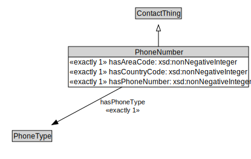

# PhoneNumber

<a href="diagrams/PhoneNumber.dot.svg">Open interactive PhoneNumber diagram</a>

## Formalization for PhoneNumber

| Property | Constraint |
|----------|------------|
| hasAreaCode | exactly 1 owl:Thing |
| hasCountryCode | exactly 1 owl:Thing |
| hasPhoneNumber | exactly 1 owl:Thing |
| hasPhoneType | exactly 1 owl:Thing |
| subClassOf | ContactThing |

## Used by classes

| Class | Property |
|-------|----------|
| [Organization](Organization.md) | hasTelephone |
| [Person](Person.md) | hasTelephone |

