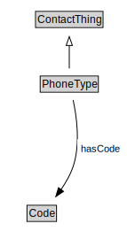

# PhoneType

EXAMPLE: home, cell, work, etc.

<a href="diagrams/PhoneType.dot.svg">Open interactive PhoneType diagram</a>

## Formalization for PhoneType

| Property | Constraint |
|----------|------------|
| hasCode | all Code |
| subClassOf | ContactThing |

