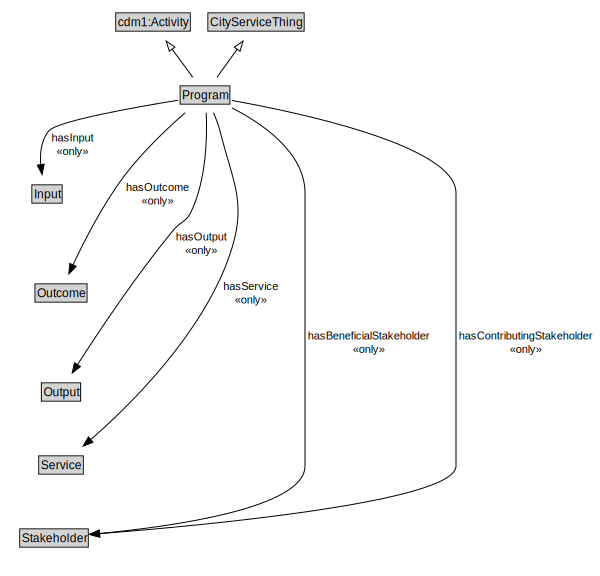

# Program

EXAMPLE: A "poverty reduction program” can be made up of a set of Services such as mobiles services that provides food and clothing to those that live on the street, and a training service that provides basic skills for those living on the street. A Program has a set of Stakeholders that may contribute or benefit.

<a href="diagrams/Program.dot.svg">Open interactive Program diagram</a>

## Formalization for Program

| Property | Constraint |
|----------|------------|
| cdm1:hasDescription | max 1 owl:Thing |
| cdm1:hasName | max 1 owl:Thing |
| hasBeneficialStakeholder | all Stakeholder |
| hasContributingStakeholder | all Stakeholder |
| hasInput | all Input |
| hasOutcome | all Outcome |
| hasOutput | all Output |
| hasService | all Service |
| subClassOf | CityServiceThing |
| subClassOf | cdm1:Activity |

## Used by classes

| Class | Property |
|-------|----------|
| [Government Organization](GovernmentOrganization.md) | hasProgram |
| [Non Profit Organization](NonProfitOrganization.md) | hasProgram |

