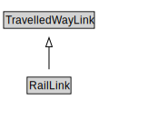

# RailLink

<a href="diagrams/RailLink.dot.svg">Open interactive RailLink diagram</a>

## Formalization for RailLink

| Property | Constraint |
|----------|------------|
| cdm1:aggregateOf | all RailLine |
| subClassOf | TravelledWayLink |

## Used by classes

| Class | Property |
|-------|----------|
| [Rail Line](RailLine.md) | cdm1:aggregationOf |
| [Rail Segment](RailSegment.md) | cdm1:properPartOf |

