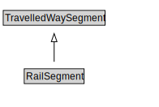

# RailSegment

<a href="diagrams/RailSegment.dot.svg">Open interactive RailSegment diagram</a>

## Formalization for RailSegment

| Property | Constraint |
|----------|------------|
| cdm1:properPartOf | some RailLink |
| subClassOf | TravelledWaySegment |

