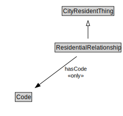

# ResidentialRelationship

<a href="diagrams/ResidentialRelationship.dot.svg">Open interactive ResidentialRelationship diagram</a>

## Formalization for ResidentialRelationship

| Property | Constraint |
|----------|------------|
| hasCode | all Code |
| subClassOf | CityResidentThing |

