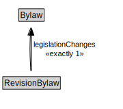

# RevisionBylaw

<a href="diagrams/RevisionBylaw.dot.svg">Open interactive RevisionBylaw diagram</a>

## Formalization for RevisionBylaw

| Property | Constraint |
|----------|------------|
| legislationChanges | exactly 1 owl:Thing |
| legislationType | has revisionBylaw |
| subClassOf | Bylaw |

