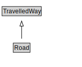

# Road

<a href="diagrams/Road.dot.svg">Open interactive Road diagram</a>

## Formalization for Road

| Property | Constraint |
|----------|------------|
| cdm1:aggregationOf | all RoadLink |
| subClassOf | TravelledWay |

## Used by classes

| Class | Property |
|-------|----------|
| [Road Link](RoadLink.md) | cdm1:aggregateOf |

