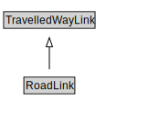

# RoadLink

<a href="diagrams/RoadLink.dot.svg">Open interactive RoadLink diagram</a>

## Formalization for RoadLink

| Property | Constraint |
|----------|------------|
| cdm1:aggregateOf | all Road |
| subClassOf | TravelledWayLink |

## Used by classes

| Class | Property |
|-------|----------|
| [Road](Road.md) | cdm1:aggregationOf |
| [Road Segment](RoadSegment.md) | cdm1:properPartOf |

