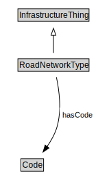

# RoadNetworkType

<a href="diagrams/RoadNetworkType.dot.svg">Open interactive RoadNetworkType diagram</a>

## Formalization for RoadNetworkType

| Property | Constraint |
|----------|------------|
| hasCode | all Code |
| subClassOf | InfrastructureThing |

## Used by classes

| Class | Property |
|-------|----------|
| [Road Segment](RoadSegment.md) | networkType |

