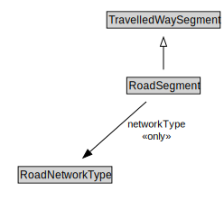

# RoadSegment

<a href="diagrams/RoadSegment.dot.svg">Open interactive RoadSegment diagram</a>

## Formalization for RoadSegment

| Property | Constraint |
|----------|------------|
| cdm1:properPartOf | some RoadLink |
| networkType | all RoadNetworkType |
| subClassOf | TravelledWaySegment |

