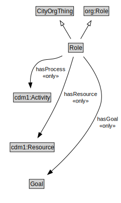

# Role

<a href="diagrams/Role.dot.svg">Open interactive Role diagram</a>

## Formalization for Role

| Property | Constraint |
|----------|------------|
| hasGoal | all Goal |
| hasProcess | all cdm1:Activity |
| hasResource | all cdm1:Resource |
| subClassOf | org:Role |
| subClassOf | CityOrgThing |

## Used by classes

| Class | Property |
|-------|----------|
| [Organization Agent](OrganizationAgent.md) | playsRole |

