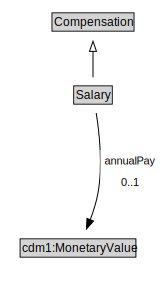

# Salary

<a href="diagrams/Salary.dot.svg">Open interactive Salary diagram</a>

## Formalization for Salary

| Property | Constraint |
|----------|------------|
| annualPay | max 1 owl:Thing |
| subClassOf | Compensation |

