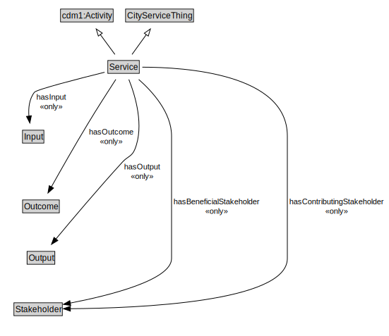

# Service

<a href="diagrams/Service.dot.svg">Open interactive Service diagram</a>

## Formalization for Service

| Property | Constraint |
|----------|------------|
| cdm1:hasDescription | max 1 owl:Thing |
| cdm1:hasName | max 1 owl:Thing |
| hasBeneficialStakeholder | all Stakeholder |
| hasContributingStakeholder | all Stakeholder |
| hasInput | all Input |
| hasOutcome | all Outcome |
| hasOutput | all Output |
| subClassOf | CityServiceThing |
| subClassOf | cdm1:Activity |

## Used by classes

| Class | Property |
|-------|----------|
| [Program](Program.md) | hasService |

