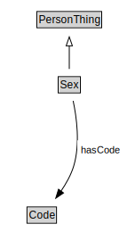

# Sex

<a href="diagrams/Sex.dot.svg">Open interactive Sex diagram</a>

## Formalization for Sex

| Property | Constraint |
|----------|------------|
| hasCode | all Code |
| subClassOf | PersonThing |

