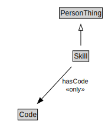

# Skill

<a href="diagrams/Skill.dot.svg">Open interactive Skill diagram</a>

## Formalization for Skill

| Property | Constraint |
|----------|------------|
| hasCode | all Code |
| subClassOf | PersonThing |

## Used by classes

| Class | Property |
|-------|----------|
| [Person](Person.md) | hasSkill |

