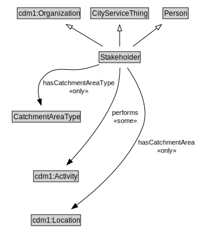

# Stakeholder

<a href="diagrams/Stakeholder.dot.svg">Open interactive Stakeholder diagram</a>

## Formalization for Stakeholder

| Property | Constraint |
|----------|------------|
| cdm1:hasDescription | all xsd:string |
| cdm1:hasName | max 1 owl:Thing |
| hasCatchmentArea | all cdm1:Location |
| hasCatchmentAreaType | all CatchmentAreaType |
| performs | some cdm1:Activity |
| subClassOf | CityServiceThing |

## Used by classes

| Class | Property |
|-------|----------|
| [Input](Input.md) | hasContributingStakeholder |
| [Program](Program.md) | hasBeneficialStakeholder |
| [Program](Program.md) | hasContributingStakeholder |
| [Service](Service.md) | hasBeneficialStakeholder |
| [Service](Service.md) | hasContributingStakeholder |

