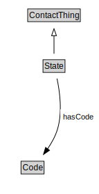

# State

<a href="diagrams/State.dot.svg">Open interactive State diagram</a>

## Formalization for State

| Property | Constraint |
|----------|------------|
| hasCode | all Code |
| subClassOf | ContactThing |

