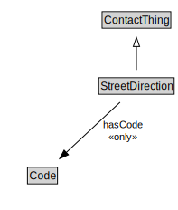

# StreetDirection

<a href="diagrams/StreetDirection.dot.svg">Open interactive StreetDirection diagram</a>

## Formalization for StreetDirection

| Property | Constraint |
|----------|------------|
| hasCode | all Code |
| subClassOf | ContactThing |

