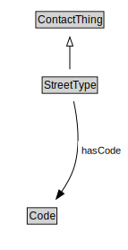

# StreetType

<a href="diagrams/StreetType.dot.svg">Open interactive StreetType diagram</a>

## Formalization for StreetType

| Property | Constraint |
|----------|------------|
| hasCode | all Code |
| subClassOf | ContactThing |

