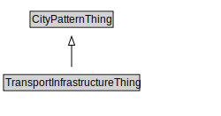

# TransportInfrastructureThing

<a href="diagrams/TransportInfrastructureThing.dot.svg">Open interactive TransportInfrastructureThing diagram</a>

## Formalization for TransportInfrastructureThing

| Property | Constraint |
|----------|------------|
| subClassOf | CityPatternThing |

