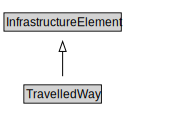

# TravelledWay

<a href="diagrams/TravelledWay.dot.svg">Open interactive TravelledWay diagram</a>

## Specializations of TravelledWay

| Class | Description |
|-------|-------------|
| [Rail Line](RailLine.md) |  |
| [Road](Road.md) |  |

## Formalization for TravelledWay

| Property | Constraint |
|----------|------------|
| cdm1:aggregationOf | all TravelledWayLink |
| subClassOf | InfrastructureElement |

## Used by classes

| Class | Property |
|-------|----------|
| [Travelled Way Link](TravelledWayLink.md) | cdm1:aggregateOf |

