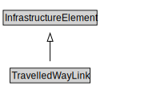

# TravelledWayLink

<a href="diagrams/TravelledWayLink.dot.svg">Open interactive TravelledWayLink diagram</a>

## Specializations of TravelledWayLink

| Class | Description |
|-------|-------------|
| [Rail Link](RailLink.md) |  |
| [Road Link](RoadLink.md) |  |

## Formalization for TravelledWayLink

| Property | Constraint |
|----------|------------|
| cdm1:aggregateOf | all TravelledWay |
| subClassOf | InfrastructureElement |

## Used by classes

| Class | Property |
|-------|----------|
| [Travelled Way](TravelledWay.md) | cdm1:aggregationOf |
| [Travelled Way Segment](TravelledWaySegment.md) | cdm1:aggregateOf |

