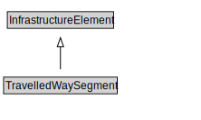

# TravelledWaySegment

<a href="diagrams/TravelledWaySegment.dot.svg">Open interactive TravelledWaySegment diagram</a>

## Specializations of TravelledWaySegment

| Class | Description |
|-------|-------------|
| [Rail Segment](RailSegment.md) |  |
| [Road Segment](RoadSegment.md) |  |

## Formalization for TravelledWaySegment

| Property | Constraint |
|----------|------------|
| cdm1:aggregateOf | some TravelledWayLink |
| subClassOf | InfrastructureElement |

## Used by classes

| Class | Property |
|-------|----------|
| [Bridge](Bridge.md) | supports |
| [Bridge Segment](BridgeSegment.md) | supports |
| [Tunnel](Tunnel.md) | supports |
| [Tunnel Segment](TunnelSegment.md) | supports |

