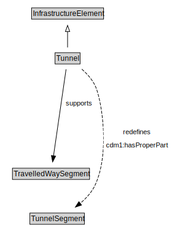

# Tunnel

<a href="diagrams/Tunnel.dot.svg">Open interactive Tunnel diagram</a>

## Formalization for Tunnel

| Property | Constraint |
|----------|------------|
| cdm1:hasProperPart | all TunnelSegment |
| subClassOf | InfrastructureElement |
| supports | all TravelledWaySegment |

