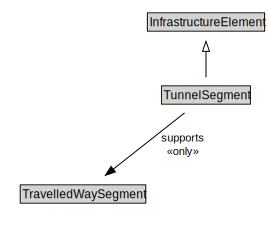

# TunnelSegment

<a href="diagrams/TunnelSegment.dot.svg">Open interactive TunnelSegment diagram</a>

## Formalization for TunnelSegment

| Property | Constraint |
|----------|------------|
| subClassOf | InfrastructureElement |
| supports | all TravelledWaySegment |

## Used by classes

| Class | Property |
|-------|----------|
| [Tunnel](Tunnel.md) | cdm1:hasProperPart |

