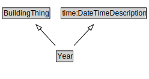

# Year

<a href="diagrams/Year.dot.svg">Open interactive Year diagram</a>

## Formalization for Year

| Property | Constraint |
|----------|------------|
| subClassOf | BuildingThing |
| subClassOf | time:DateTimeDescription |

