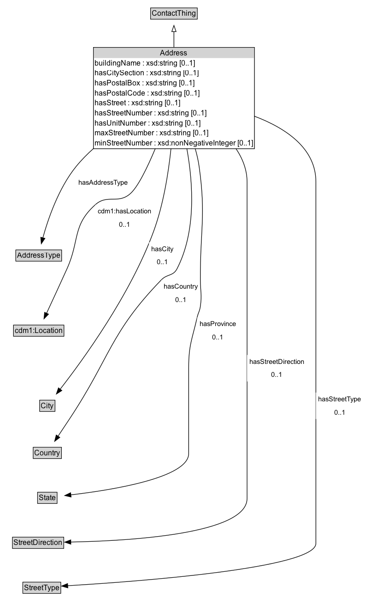

# Address

Address is the main concept for a contact.  It has been designed to represent any type of address in the world, including India and the UK.  For example, the property hasBuilding is important in many UK and Indian addresses to further identify the person or business location. Street information is divided into separate properties to fully identify direction (hasStreetDirection), Type (hasStreetType), etc.

## Diagram

=== "SVG (interactive)"

    <!-- Generated by graphviz version 14.1.3 (20260303.0454)
     -->
    <!-- Pages: 1 -->
    <svg width="596pt" height="993pt"
     viewBox="0.00 0.00 596.00 993.00" xmlns="http://www.w3.org/2000/svg" xmlns:xlink="http://www.w3.org/1999/xlink">
    <g id="graph0" class="graph" transform="scale(1 1) rotate(0) translate(4 988.5)">
    <polygon fill="white" stroke="none" points="-4,4 -4,-988.5 591.75,-988.5 591.75,4 -4,4"/>
    <g id="clust3" class="cluster">
    <title>cluster_associated</title>
    </g>
    <!-- ContactThing -->
    <g id="node1" class="node">
    <title>ContactThing</title>
    <g id="a_node1"><a xlink:href="../ContactThing" xlink:title="&lt;TABLE&gt;">
    <polygon fill="lightgray" stroke="none" points="242,-958.38 242,-974.62 316,-974.62 316,-958.38 242,-958.38"/>
    <text xml:space="preserve" text-anchor="start" x="243" y="-962.38" font-family="Arial" font-size="12.00">ContactThing</text>
    <polygon fill="none" stroke="black" points="241,-957.38 241,-975.62 317,-975.62 317,-957.38 241,-957.38"/>
    </a>
    </g>
    </g>
    <!-- Address -->
    <g id="node2" class="node">
    <title>Address</title>
    <g id="a_node2"><a xlink:href="../Address" xlink:title="&lt;TABLE&gt;">
    <polygon fill="lightgray" stroke="none" points="149,-894.25 149,-910.5 409,-910.5 409,-894.25 149,-894.25"/>
    <text xml:space="preserve" text-anchor="start" x="256.88" y="-898.25" font-family="Arial" font-size="12.00">Address</text>
    <text xml:space="preserve" text-anchor="start" x="150" y="-882" font-family="Arial" font-size="12.00">buildingName : xsd:string [0..1]</text>
    <text xml:space="preserve" text-anchor="start" x="150" y="-865.75" font-family="Arial" font-size="12.00">hasCitySection : xsd:string [0..1]</text>
    <text xml:space="preserve" text-anchor="start" x="150" y="-849.5" font-family="Arial" font-size="12.00">hasPostalBox : xsd:string [0..1]</text>
    <text xml:space="preserve" text-anchor="start" x="150" y="-833.25" font-family="Arial" font-size="12.00">hasPostalCode : xsd:string [0..1]</text>
    <text xml:space="preserve" text-anchor="start" x="150" y="-817" font-family="Arial" font-size="12.00">hasStreet : xsd:string [0..1]</text>
    <text xml:space="preserve" text-anchor="start" x="150" y="-800.75" font-family="Arial" font-size="12.00">hasStreetNumber : xsd:string [0..1]</text>
    <text xml:space="preserve" text-anchor="start" x="150" y="-784.5" font-family="Arial" font-size="12.00">hasUnitNumber : xsd:string [0..1]</text>
    <text xml:space="preserve" text-anchor="start" x="150" y="-768.25" font-family="Arial" font-size="12.00">maxStreetNumber : xsd:string [0..1]</text>
    <text xml:space="preserve" text-anchor="start" x="150" y="-752" font-family="Arial" font-size="12.00">minStreetNumber : xsd:nonNegativeInteger [0..1]</text>
    <polygon fill="none" stroke="black" points="148,-747 148,-911.5 410,-911.5 410,-747 148,-747"/>
    </a>
    </g>
    </g>
    <!-- Address&#45;&gt;ContactThing -->
    <g id="edge1" class="edge">
    <title>Address&#45;&gt;ContactThing</title>
    <path fill="none" stroke="black" d="M279,-911.23C279,-920.52 279,-929.46 279,-937.31"/>
    <polygon fill="none" stroke="black" points="275.5,-937.13 279,-947.13 282.5,-937.13 275.5,-937.13"/>
    </g>
    <!-- Invis -->
    <!-- Address&#45;&gt;Invis -->
    <!-- AddressType -->
    <g id="node4" class="node">
    <title>AddressType</title>
    <g id="a_node4"><a xlink:href="../AddressType" xlink:title="&lt;TABLE&gt;">
    <polygon fill="lightgray" stroke="none" points="22.75,-565.38 22.75,-581.62 95.25,-581.62 95.25,-565.38 22.75,-565.38"/>
    <text xml:space="preserve" text-anchor="start" x="23.75" y="-569.38" font-family="Arial" font-size="12.00">AddressType</text>
    <polygon fill="none" stroke="black" points="21.75,-564.38 21.75,-582.62 96.25,-582.62 96.25,-564.38 21.75,-564.38"/>
    </a>
    </g>
    </g>
    <!-- Address&#45;&gt;AddressType -->
    <g id="edge11" class="edge">
    <title>Address&#45;&gt;AddressType</title>
    <path fill="none" stroke="black" d="M148.33,-747.52C137.96,-738.3 128.24,-728.43 119.75,-718 91.29,-683.01 74.14,-632.74 65.63,-601.93"/>
    <polygon fill="black" stroke="black" points="69.11,-601.39 63.17,-592.61 62.34,-603.17 69.11,-601.39"/>
    <polygon fill="white" stroke="none" points="119.75,-681.25 119.75,-702.75 208,-702.75 208,-681.25 119.75,-681.25"/>
    <text xml:space="preserve" text-anchor="start" x="123.75" y="-688.25" font-family="Arial" font-size="11.00">hasAddressType</text>
    </g>
    <!-- cdm1_Location -->
    <g id="node5" class="node">
    <title>cdm1_Location</title>
    <g id="a_node5"><a xlink:href="https://w3id.org/citydata/part1/v1/Location" xlink:title="&lt;TABLE&gt;">
    <polygon fill="lightgray" stroke="none" points="19,-443.38 19,-459.62 99,-459.62 99,-443.38 19,-443.38"/>
    <text xml:space="preserve" text-anchor="start" x="20" y="-447.38" font-family="Arial" font-size="12.00">cdm1:Location</text>
    <polygon fill="none" stroke="black" points="18,-442.38 18,-460.62 100,-460.62 100,-442.38 18,-442.38"/>
    </a>
    </g>
    </g>
    <!-- Address&#45;&gt;cdm1_Location -->
    <g id="edge14" class="edge">
    <title>Address&#45;&gt;cdm1_Location</title>
    <path fill="none" stroke="black" d="M248.63,-747.1C235.52,-715.81 220.38,-684.92 208,-674 188.07,-656.43 170.79,-673.72 151,-656 113.34,-622.29 125.83,-598.05 105,-552 93.88,-527.42 80.97,-499.55 71.67,-479.58"/>
    <polygon fill="black" stroke="black" points="74.94,-478.32 67.54,-470.73 68.6,-481.28 74.94,-478.32"/>
    <polygon fill="white" stroke="none" points="151,-613 151,-656 246,-656 246,-613 151,-613"/>
    <text xml:space="preserve" text-anchor="start" x="155" y="-641.5" font-family="Arial" font-size="11.00">cdm1:hasLocation</text>
    <text xml:space="preserve" text-anchor="start" x="189.5" y="-620" font-family="Arial" font-size="11.00">0..1</text>
    </g>
    <!-- City -->
    <g id="node6" class="node">
    <title>City</title>
    <g id="a_node6"><a xlink:href="../City" xlink:title="&lt;TABLE&gt;">
    <polygon fill="lightgray" stroke="none" points="61.5,-321.38 61.5,-337.62 84.5,-337.62 84.5,-321.38 61.5,-321.38"/>
    <text xml:space="preserve" text-anchor="start" x="62.5" y="-325.38" font-family="Arial" font-size="12.00">City</text>
    <polygon fill="none" stroke="black" points="60.5,-320.38 60.5,-338.62 85.5,-338.62 85.5,-320.38 60.5,-320.38"/>
    </a>
    </g>
    </g>
    <!-- Address&#45;&gt;City -->
    <g id="edge10" class="edge">
    <title>Address&#45;&gt;City</title>
    <path fill="none" stroke="black" d="M274.21,-747.13C269.88,-705.98 261.66,-655.78 246,-613 208.37,-510.18 131.03,-404.05 93.85,-356.4"/>
    <polygon fill="black" stroke="black" points="96.64,-354.28 87.71,-348.59 91.14,-358.61 96.64,-354.28"/>
    <polygon fill="white" stroke="none" points="238.4,-552 238.4,-595 282.4,-595 282.4,-552 238.4,-552"/>
    <text xml:space="preserve" text-anchor="start" x="242.4" y="-580.5" font-family="Arial" font-size="11.00">hasCity</text>
    <text xml:space="preserve" text-anchor="start" x="251.4" y="-559" font-family="Arial" font-size="11.00">0..1</text>
    </g>
    <!-- Country -->
    <g id="node7" class="node">
    <title>Country</title>
    <g id="a_node7"><a xlink:href="../Country" xlink:title="&lt;TABLE&gt;">
    <polygon fill="lightgray" stroke="none" points="51,-244.88 51,-261.12 95,-261.12 95,-244.88 51,-244.88"/>
    <text xml:space="preserve" text-anchor="start" x="52" y="-248.88" font-family="Arial" font-size="12.00">Country</text>
    <polygon fill="none" stroke="black" points="50,-243.88 50,-262.12 96,-262.12 96,-243.88 50,-243.88"/>
    </a>
    </g>
    </g>
    <!-- Address&#45;&gt;Country -->
    <g id="edge13" class="edge">
    <title>Address&#45;&gt;Country</title>
    <path fill="none" stroke="black" d="M300.01,-747.14C310.46,-689.48 315.06,-611.95 284,-552 277.62,-539.68 268.16,-543.96 258.5,-534 174.64,-447.56 175.62,-408.33 109,-308 102.93,-298.86 96.27,-288.86 90.35,-279.98"/>
    <polygon fill="black" stroke="black" points="93.35,-278.17 84.88,-271.79 87.52,-282.05 93.35,-278.17"/>
    <polygon fill="white" stroke="none" points="258.5,-491 258.5,-534 322,-534 322,-491 258.5,-491"/>
    <text xml:space="preserve" text-anchor="start" x="262.5" y="-519.5" font-family="Arial" font-size="11.00">hasCountry</text>
    <text xml:space="preserve" text-anchor="start" x="281.25" y="-498" font-family="Arial" font-size="11.00">0..1</text>
    </g>
    <!-- State -->
    <g id="node8" class="node">
    <title>State</title>
    <g id="a_node8"><a xlink:href="../State" xlink:title="&lt;TABLE&gt;">
    <polygon fill="lightgray" stroke="none" points="58.12,-171.88 58.12,-188.12 87.88,-188.12 87.88,-171.88 58.12,-171.88"/>
    <text xml:space="preserve" text-anchor="start" x="59.12" y="-175.88" font-family="Arial" font-size="12.00">State</text>
    <polygon fill="none" stroke="black" points="57.12,-170.88 57.12,-189.12 88.88,-189.12 88.88,-170.88 57.12,-170.88"/>
    </a>
    </g>
    </g>
    <!-- Address&#45;&gt;State -->
    <g id="edge16" class="edge">
    <title>Address&#45;&gt;State</title>
    <path fill="none" stroke="black" d="M313.62,-747.1C316.41,-737.44 318.66,-727.61 320,-718 331.3,-637 321.56,-615.78 322,-534 322.1,-514.89 324.7,-509.92 322,-491 320.82,-482.75 318.61,-481.12 316.75,-473 308.54,-437.2 303,-428.23 303,-391.5 303,-391.5 303,-391.5 303,-252 303,-212.28 176.19,-192.4 110.89,-184.8"/>
    <polygon fill="black" stroke="black" points="111.67,-181.36 101.34,-183.73 110.89,-188.32 111.67,-181.36"/>
    <polygon fill="white" stroke="none" points="316.75,-430 316.75,-473 384,-473 384,-430 316.75,-430"/>
    <text xml:space="preserve" text-anchor="start" x="320.75" y="-458.5" font-family="Arial" font-size="11.00">hasProvince</text>
    <text xml:space="preserve" text-anchor="start" x="341.38" y="-437" font-family="Arial" font-size="11.00">0..1</text>
    </g>
    <!-- StreetDirection -->
    <g id="node9" class="node">
    <title>StreetDirection</title>
    <g id="a_node9"><a xlink:href="../StreetDirection" xlink:title="&lt;TABLE&gt;">
    <polygon fill="lightgray" stroke="none" points="17.25,-98.88 17.25,-115.12 98.75,-115.12 98.75,-98.88 17.25,-98.88"/>
    <text xml:space="preserve" text-anchor="start" x="18.25" y="-102.88" font-family="Arial" font-size="12.00">StreetDirection</text>
    <polygon fill="none" stroke="black" points="16.25,-97.88 16.25,-116.12 99.75,-116.12 99.75,-97.88 16.25,-97.88"/>
    </a>
    </g>
    </g>
    <!-- Address&#45;&gt;StreetDirection -->
    <g id="edge15" class="edge">
    <title>Address&#45;&gt;StreetDirection</title>
    <path fill="none" stroke="black" d="M379.93,-747.14C390.79,-730.9 398,-712.7 398,-693 398,-693 398,-693 398,-179 398,-121.11 206.77,-110.12 111.14,-108.24"/>
    <polygon fill="black" stroke="black" points="111.26,-104.74 101.2,-108.07 111.14,-111.74 111.26,-104.74"/>
    <polygon fill="white" stroke="none" points="398,-369 398,-412 495.25,-412 495.25,-369 398,-369"/>
    <text xml:space="preserve" text-anchor="start" x="402" y="-397.5" font-family="Arial" font-size="11.00">hasStreetDirection</text>
    <text xml:space="preserve" text-anchor="start" x="437.62" y="-376" font-family="Arial" font-size="11.00">0..1</text>
    </g>
    <!-- StreetType -->
    <g id="node10" class="node">
    <title>StreetType</title>
    <g id="a_node10"><a xlink:href="../StreetType" xlink:title="&lt;TABLE&gt;">
    <polygon fill="lightgray" stroke="none" points="34.12,-25.88 34.12,-42.12 93.88,-42.12 93.88,-25.88 34.12,-25.88"/>
    <text xml:space="preserve" text-anchor="start" x="35.12" y="-29.88" font-family="Arial" font-size="12.00">StreetType</text>
    <polygon fill="none" stroke="black" points="33.12,-24.88 33.12,-43.12 94.88,-43.12 94.88,-24.88 33.12,-24.88"/>
    </a>
    </g>
    </g>
    <!-- Address&#45;&gt;StreetType -->
    <g id="edge12" class="edge">
    <title>Address&#45;&gt;StreetType</title>
    <path fill="none" stroke="black" d="M409.69,-799.89C461.96,-780.16 510,-747.26 510,-693 510,-693 510,-693 510,-106 510,-65.34 217.15,-43.95 106.05,-37.31"/>
    <polygon fill="black" stroke="black" points="106.35,-33.82 96.17,-36.73 105.94,-40.81 106.35,-33.82"/>
    <polygon fill="white" stroke="none" points="510,-308 510,-351 587.75,-351 587.75,-308 510,-308"/>
    <text xml:space="preserve" text-anchor="start" x="514" y="-336.5" font-family="Arial" font-size="11.00">hasStreetType</text>
    <text xml:space="preserve" text-anchor="start" x="539.88" y="-315" font-family="Arial" font-size="11.00">0..1</text>
    </g>
    <!-- Invis&#45;&gt;AddressType -->
    <!-- AddressType&#45;&gt;cdm1_Location -->
    <!-- cdm1_Location&#45;&gt;City -->
    <!-- City&#45;&gt;Country -->
    <!-- Country&#45;&gt;State -->
    <!-- State&#45;&gt;StreetDirection -->
    <!-- StreetDirection&#45;&gt;StreetType -->
    </g>
    </svg>

=== "PNG"

    

## Formalization for Address

| Property | Constraint |
|----------|------------|
| [buildingName](../properties/buildingName.md) | max 1 |
| [buildingName](../properties/buildingName.md) | max 1 xsd:string |
| [cdm1:hasLocation](https://w3id.org/citydata/part1/v1/hasLocation) | max 1 |
| [cdm1:hasLocation](https://w3id.org/citydata/part1/v1/hasLocation) | max 1 [cdm1:Location](https://w3id.org/citydata/part1/v1/Location) |
| [hasAddressType](../properties/hasAddressType.md) | only [AddressType](https://w3id.org/citydata/part2/v1/AddressType) |
| [hasCity](../properties/hasCity.md) | max 1 |
| [hasCity](../properties/hasCity.md) | max 1 [City](https://w3id.org/citydata/part2/v1/City) |
| [hasCitySection](../properties/hasCitySection.md) | max 1 |
| [hasCitySection](../properties/hasCitySection.md) | max 1 xsd:string |
| [hasCountry](../properties/hasCountry.md) | max 1 |
| [hasCountry](../properties/hasCountry.md) | max 1 [Country](https://w3id.org/citydata/part2/v1/Country) |
| [hasPostalBox](../properties/hasPostalBox.md) | max 1 |
| [hasPostalBox](../properties/hasPostalBox.md) | max 1 xsd:string |
| [hasPostalCode](../properties/hasPostalCode.md) | max 1 |
| [hasPostalCode](../properties/hasPostalCode.md) | max 1 xsd:string |
| [hasProvince](../properties/hasProvince.md) | max 1 |
| [hasProvince](../properties/hasProvince.md) | max 1 [State](https://w3id.org/citydata/part2/v1/State) |
| [hasStreet](../properties/hasStreet.md) | max 1 |
| [hasStreet](../properties/hasStreet.md) | max 1 xsd:string |
| [hasStreetDirection](../properties/hasStreetDirection.md) | max 1 |
| [hasStreetDirection](../properties/hasStreetDirection.md) | max 1 [StreetDirection](https://w3id.org/citydata/part2/v1/StreetDirection) |
| [hasStreetNumber](../properties/hasStreetNumber.md) | max 1 |
| [hasStreetNumber](../properties/hasStreetNumber.md) | max 1 xsd:string |
| [hasStreetType](../properties/hasStreetType.md) | max 1 |
| [hasStreetType](../properties/hasStreetType.md) | max 1 [StreetType](https://w3id.org/citydata/part2/v1/StreetType) |
| [hasUnitNumber](../properties/hasUnitNumber.md) | max 1 |
| [hasUnitNumber](../properties/hasUnitNumber.md) | max 1 xsd:string |
| [maxStreetNumber](../properties/maxStreetNumber.md) | max 1 |
| [maxStreetNumber](../properties/maxStreetNumber.md) | max 1 xsd:string |
| [minStreetNumber](../properties/minStreetNumber.md) | max 1 |
| [minStreetNumber](../properties/minStreetNumber.md) | max 1 xsd:nonNegativeInteger |
| subClassOf | [ContactThing](ContactThing.md) |

