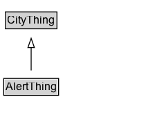

# AlertThing

Added for organizational purposes, to identify classes defined for the Alert Pattern.

## Diagram

=== "SVG (interactive)"

    <!-- Generated by graphviz version 14.1.3 (20260303.0454)
     -->
    <!-- Pages: 1 -->
    <svg width="156pt" height="132pt"
     viewBox="0.00 0.00 156.00 132.00" xmlns="http://www.w3.org/2000/svg" xmlns:xlink="http://www.w3.org/1999/xlink">
    <g id="graph0" class="graph" transform="scale(1 1) rotate(0) translate(4 128)">
    <polygon fill="white" stroke="none" points="-4,4 -4,-128 151.75,-128 151.75,4 -4,4"/>
    <g id="clust3" class="cluster">
    <title>cluster_associated</title>
    </g>
    <!-- CityThing -->
    <g id="node1" class="node">
    <title>CityThing</title>
    <g id="a_node1"><a xlink:href="../CityThing" xlink:title="&lt;TABLE&gt;">
    <polygon fill="lightgray" stroke="none" points="2.88,-97.88 2.88,-114.12 56.62,-114.12 56.62,-97.88 2.88,-97.88"/>
    <text xml:space="preserve" text-anchor="start" x="3.88" y="-101.88" font-family="Arial" font-size="12.00">CityThing</text>
    <polygon fill="none" stroke="black" points="1.88,-96.88 1.88,-115.12 57.62,-115.12 57.62,-96.88 1.88,-96.88"/>
    </a>
    </g>
    </g>
    <!-- AlertThing -->
    <g id="node2" class="node">
    <title>AlertThing</title>
    <g id="a_node2"><a xlink:href="../AlertThing" xlink:title="&lt;TABLE&gt;">
    <polygon fill="lightgray" stroke="none" points="1,-25.88 1,-42.12 58.5,-42.12 58.5,-25.88 1,-25.88"/>
    <text xml:space="preserve" text-anchor="start" x="2" y="-29.88" font-family="Arial" font-size="12.00">AlertThing</text>
    <polygon fill="none" stroke="black" points="0,-24.88 0,-43.12 59.5,-43.12 59.5,-24.88 0,-24.88"/>
    </a>
    </g>
    </g>
    <!-- AlertThing&#45;&gt;CityThing -->
    <g id="edge1" class="edge">
    <title>AlertThing&#45;&gt;CityThing</title>
    <path fill="none" stroke="black" d="M29.75,-51.79C29.75,-59.25 29.75,-68.24 29.75,-76.69"/>
    <polygon fill="none" stroke="black" points="26.25,-76.54 29.75,-86.54 33.25,-76.54 26.25,-76.54"/>
    </g>
    <!-- Invis -->
    </g>
    </svg>

=== "PNG"

    

## Specializations of AlertThing

| Class | Description |
|-------|-------------|
| [Alert](Alert.md) | An Alert can be used to notify people of important information. |

## Formalization for AlertThing

| Property | Constraint |
|----------|------------|
| subClassOf | [CityThing](CityThing.md) |

