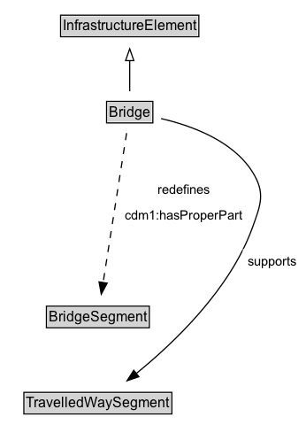

# Bridge

A Bridge is a Infrastructure Element that enables travel over some obstacle or area. It may contain some Road Segments or Rail Line Segments.

NOTE: A Bridge is identified as such by a governing body.

## Diagram

=== "SVG (interactive)"

    <!-- Generated by graphviz version 14.1.3 (20260303.0454)
     -->
    <!-- Pages: 1 -->
    <svg width="259pt" height="380pt"
     viewBox="0.00 0.00 259.00 380.00" xmlns="http://www.w3.org/2000/svg" xmlns:xlink="http://www.w3.org/1999/xlink">
    <g id="graph0" class="graph" transform="scale(1 1) rotate(0) translate(4 375.5)">
    <polygon fill="white" stroke="none" points="-4,4 -4,-375.5 255.17,-375.5 255.17,4 -4,4"/>
    <g id="clust3" class="cluster">
    <title>cluster_associated</title>
    </g>
    <!-- InfrastructureElement -->
    <g id="node1" class="node">
    <title>InfrastructureElement</title>
    <g id="a_node1"><a xlink:href="../InfrastructureElement" xlink:title="&lt;TABLE&gt;">
    <polygon fill="lightgray" stroke="none" points="48.38,-345.38 48.38,-361.62 163.62,-361.62 163.62,-345.38 48.38,-345.38"/>
    <text xml:space="preserve" text-anchor="start" x="49.38" y="-349.38" font-family="Arial" font-size="12.00">InfrastructureElement</text>
    <polygon fill="none" stroke="black" points="47.38,-344.38 47.38,-362.62 164.62,-362.62 164.62,-344.38 47.38,-344.38"/>
    </a>
    </g>
    </g>
    <!-- Bridge -->
    <g id="node2" class="node">
    <title>Bridge</title>
    <g id="a_node2"><a xlink:href="../Bridge" xlink:title="&lt;TABLE&gt;">
    <polygon fill="lightgray" stroke="none" points="87.38,-272.38 87.38,-288.62 124.62,-288.62 124.62,-272.38 87.38,-272.38"/>
    <text xml:space="preserve" text-anchor="start" x="88.38" y="-276.38" font-family="Arial" font-size="12.00">Bridge</text>
    <polygon fill="none" stroke="black" points="86.38,-271.38 86.38,-289.62 125.62,-289.62 125.62,-271.38 86.38,-271.38"/>
    </a>
    </g>
    </g>
    <!-- Bridge&#45;&gt;InfrastructureElement -->
    <g id="edge1" class="edge">
    <title>Bridge&#45;&gt;InfrastructureElement</title>
    <path fill="none" stroke="black" d="M106,-298.21C106,-305.97 106,-315.42 106,-324.24"/>
    <polygon fill="none" stroke="black" points="102.5,-324.16 106,-334.16 109.5,-324.16 102.5,-324.16"/>
    </g>
    <!-- Invis -->
    <!-- Bridge&#45;&gt;Invis -->
    <!-- BridgeSegment -->
    <g id="node4" class="node">
    <title>BridgeSegment</title>
    <g id="a_node4"><a xlink:href="../BridgeSegment" xlink:title="&lt;TABLE&gt;">
    <polygon fill="lightgray" stroke="none" points="36.38,-98.88 36.38,-115.12 121.62,-115.12 121.62,-98.88 36.38,-98.88"/>
    <text xml:space="preserve" text-anchor="start" x="37.38" y="-102.88" font-family="Arial" font-size="12.00">BridgeSegment</text>
    <polygon fill="none" stroke="black" points="35.38,-97.88 35.38,-116.12 122.62,-116.12 122.62,-97.88 35.38,-97.88"/>
    </a>
    </g>
    </g>
    <!-- Bridge&#45;&gt;BridgeSegment -->
    <g id="edge6" class="edge">
    <title>Bridge&#45;&gt;BridgeSegment</title>
    <path fill="none" stroke="black" stroke-dasharray="5,2" d="M103.36,-262.74C98.72,-233.29 89.07,-171.94 83.4,-135.97"/>
    <polygon fill="black" stroke="black" points="86.9,-135.65 81.88,-126.32 79.98,-136.74 86.9,-135.65"/>
    <polygon fill="white" stroke="none" points="98.19,-182.5 98.19,-225.5 205.94,-225.5 205.94,-182.5 98.19,-182.5"/>
    <text xml:space="preserve" text-anchor="start" x="129.94" y="-211" font-family="Arial" font-size="11.00">redefines</text>
    <text xml:space="preserve" text-anchor="start" x="102.19" y="-189.5" font-family="Arial" font-size="11.00">cdm1:hasProperPart</text>
    </g>
    <!-- TravelledWaySegment -->
    <g id="node5" class="node">
    <title>TravelledWaySegment</title>
    <g id="a_node5"><a xlink:href="../TravelledWaySegment" xlink:title="&lt;TABLE&gt;">
    <polygon fill="lightgray" stroke="none" points="17.25,-25.88 17.25,-42.12 140.75,-42.12 140.75,-25.88 17.25,-25.88"/>
    <text xml:space="preserve" text-anchor="start" x="18.25" y="-29.88" font-family="Arial" font-size="12.00">TravelledWaySegment</text>
    <polygon fill="none" stroke="black" points="16.25,-24.88 16.25,-43.12 141.75,-43.12 141.75,-24.88 16.25,-24.88"/>
    </a>
    </g>
    </g>
    <!-- Bridge&#45;&gt;TravelledWaySegment -->
    <g id="edge5" class="edge">
    <title>Bridge&#45;&gt;TravelledWaySegment</title>
    <path fill="none" stroke="black" d="M132.64,-275.04C157.47,-269.31 193.13,-256.71 210,-230 221.27,-212.15 217.19,-202.35 210,-182.5 191.07,-130.26 143.52,-84.99 111.22,-58.84"/>
    <polygon fill="black" stroke="black" points="113.76,-56.38 103.74,-52.92 109.41,-61.87 113.76,-56.38"/>
    <polygon fill="white" stroke="none" points="201.92,-143 201.92,-164.5 251.17,-164.5 251.17,-143 201.92,-143"/>
    <text xml:space="preserve" text-anchor="start" x="205.92" y="-150" font-family="Arial" font-size="11.00">supports</text>
    </g>
    <!-- Invis&#45;&gt;BridgeSegment -->
    <!-- BridgeSegment&#45;&gt;TravelledWaySegment -->
    </g>
    </svg>

=== "PNG"

    

## Formalization for Bridge

| Property | Constraint |
|----------|------------|
| [cdm1:hasProperPart](https://w3id.org/citydata/part1/v1/hasProperPart) | only [BridgeSegment](https://w3id.org/citydata/part2/v1/BridgeSegment) |
| [supports](../properties/supports.md) | only [TravelledWaySegment](https://w3id.org/citydata/part2/v1/TravelledWaySegment) |
| subClassOf | [InfrastructureElement](InfrastructureElement.md) |

