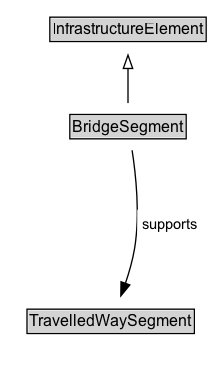

# BridgeSegment

## Diagram

=== "SVG (interactive)"

    <!-- Generated by graphviz version 14.1.3 (20260303.0454)
     -->
    <!-- Pages: 1 -->
    <svg width="166pt" height="279pt"
     viewBox="0.00 0.00 166.00 279.00" xmlns="http://www.w3.org/2000/svg" xmlns:xlink="http://www.w3.org/1999/xlink">
    <g id="graph0" class="graph" transform="scale(1 1) rotate(0) translate(4 275)">
    <polygon fill="white" stroke="none" points="-4,4 -4,-275 162,-275 162,4 -4,4"/>
    <g id="clust3" class="cluster">
    <title>cluster_associated</title>
    </g>
    <!-- InfrastructureElement -->
    <g id="node1" class="node">
    <title>InfrastructureElement</title>
    <g id="a_node1"><a xlink:href="../InfrastructureElement" xlink:title="&lt;TABLE&gt;">
    <polygon fill="lightgray" stroke="none" points="34.38,-244.88 34.38,-261.12 149.62,-261.12 149.62,-244.88 34.38,-244.88"/>
    <text xml:space="preserve" text-anchor="start" x="35.38" y="-248.88" font-family="Arial" font-size="12.00">InfrastructureElement</text>
    <polygon fill="none" stroke="black" points="33.38,-243.88 33.38,-262.12 150.62,-262.12 150.62,-243.88 33.38,-243.88"/>
    </a>
    </g>
    </g>
    <!-- BridgeSegment -->
    <g id="node2" class="node">
    <title>BridgeSegment</title>
    <g id="a_node2"><a xlink:href="../BridgeSegment" xlink:title="&lt;TABLE&gt;">
    <polygon fill="lightgray" stroke="none" points="49.38,-171.88 49.38,-188.12 134.62,-188.12 134.62,-171.88 49.38,-171.88"/>
    <text xml:space="preserve" text-anchor="start" x="50.38" y="-175.88" font-family="Arial" font-size="12.00">BridgeSegment</text>
    <polygon fill="none" stroke="black" points="48.38,-170.88 48.38,-189.12 135.62,-189.12 135.62,-170.88 48.38,-170.88"/>
    </a>
    </g>
    </g>
    <!-- BridgeSegment&#45;&gt;InfrastructureElement -->
    <g id="edge1" class="edge">
    <title>BridgeSegment&#45;&gt;InfrastructureElement</title>
    <path fill="none" stroke="black" d="M92,-197.71C92,-205.47 92,-214.92 92,-223.74"/>
    <polygon fill="none" stroke="black" points="88.5,-223.66 92,-233.66 95.5,-223.66 88.5,-223.66"/>
    </g>
    <!-- Invis -->
    <!-- BridgeSegment&#45;&gt;Invis -->
    <!-- TravelledWaySegment -->
    <g id="node4" class="node">
    <title>TravelledWaySegment</title>
    <g id="a_node4"><a xlink:href="../TravelledWaySegment" xlink:title="&lt;TABLE&gt;">
    <polygon fill="lightgray" stroke="none" points="17.25,-25.88 17.25,-42.12 140.75,-42.12 140.75,-25.88 17.25,-25.88"/>
    <text xml:space="preserve" text-anchor="start" x="18.25" y="-29.88" font-family="Arial" font-size="12.00">TravelledWaySegment</text>
    <polygon fill="none" stroke="black" points="16.25,-24.88 16.25,-43.12 141.75,-43.12 141.75,-24.88 16.25,-24.88"/>
    </a>
    </g>
    </g>
    <!-- BridgeSegment&#45;&gt;TravelledWaySegment -->
    <g id="edge4" class="edge">
    <title>BridgeSegment&#45;&gt;TravelledWaySegment</title>
    <path fill="none" stroke="black" d="M95.07,-162.3C97.9,-144.14 101.11,-114.33 97,-89 95.56,-80.15 92.88,-70.79 90.02,-62.39"/>
    <polygon fill="black" stroke="black" points="93.35,-61.29 86.63,-53.09 86.77,-63.69 93.35,-61.29"/>
    <polygon fill="white" stroke="none" points="98.96,-96.25 98.96,-117.75 148.21,-117.75 148.21,-96.25 98.96,-96.25"/>
    <text xml:space="preserve" text-anchor="start" x="102.96" y="-103.25" font-family="Arial" font-size="11.00">supports</text>
    </g>
    <!-- Invis&#45;&gt;TravelledWaySegment -->
    </g>
    </svg>

=== "PNG"

    

## Formalization for BridgeSegment

| Property | Constraint |
|----------|------------|
| [supports](../properties/supports.md) | only [TravelledWaySegment](https://w3id.org/citydata/part2/v1/TravelledWaySegment) |
| subClassOf | [InfrastructureElement](InfrastructureElement.md) |

