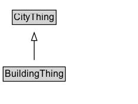

# BuildingThing

Added for organizational purposes, to identify classes defined in the Building ontology.

## Diagram

=== "SVG (interactive)"

    <!-- Generated by graphviz version 14.1.3 (20260303.0454)
     -->
    <!-- Pages: 1 -->
    <svg width="176pt" height="132pt"
     viewBox="0.00 0.00 176.00 132.00" xmlns="http://www.w3.org/2000/svg" xmlns:xlink="http://www.w3.org/1999/xlink">
    <g id="graph0" class="graph" transform="scale(1 1) rotate(0) translate(4 128)">
    <polygon fill="white" stroke="none" points="-4,4 -4,-128 171.5,-128 171.5,4 -4,4"/>
    <g id="clust3" class="cluster">
    <title>cluster_associated</title>
    </g>
    <!-- CityThing -->
    <g id="node1" class="node">
    <title>CityThing</title>
    <g id="a_node1"><a xlink:href="../CityThing" xlink:title="&lt;TABLE&gt;">
    <polygon fill="lightgray" stroke="none" points="12.62,-97.88 12.62,-114.12 66.38,-114.12 66.38,-97.88 12.62,-97.88"/>
    <text xml:space="preserve" text-anchor="start" x="13.62" y="-101.88" font-family="Arial" font-size="12.00">CityThing</text>
    <polygon fill="none" stroke="black" points="11.62,-96.88 11.62,-115.12 67.38,-115.12 67.38,-96.88 11.62,-96.88"/>
    </a>
    </g>
    </g>
    <!-- BuildingThing -->
    <g id="node2" class="node">
    <title>BuildingThing</title>
    <g id="a_node2"><a xlink:href="../BuildingThing" xlink:title="&lt;TABLE&gt;">
    <polygon fill="lightgray" stroke="none" points="1,-25.88 1,-42.12 78,-42.12 78,-25.88 1,-25.88"/>
    <text xml:space="preserve" text-anchor="start" x="2" y="-29.88" font-family="Arial" font-size="12.00">BuildingThing</text>
    <polygon fill="none" stroke="black" points="0,-24.88 0,-43.12 79,-43.12 79,-24.88 0,-24.88"/>
    </a>
    </g>
    </g>
    <!-- BuildingThing&#45;&gt;CityThing -->
    <g id="edge1" class="edge">
    <title>BuildingThing&#45;&gt;CityThing</title>
    <path fill="none" stroke="black" d="M39.5,-51.79C39.5,-59.25 39.5,-68.24 39.5,-76.69"/>
    <polygon fill="none" stroke="black" points="36,-76.54 39.5,-86.54 43,-76.54 36,-76.54"/>
    </g>
    <!-- Invis -->
    </g>
    </svg>

=== "PNG"

    

## Specializations of BuildingThing

| Class | Description |
|-------|-------------|
| [Area Ratio](AreaRatio.md) |  |
| [Building](Building.md) | A Building is a type of Infrastructure Element that is a structure with a roof and walls, such as a house, school, or factory. The location of a Building may change due to construction, but the Parcel/Lot of land it is located on cannot (i.e., moving an entire building results in a change in object instance).  |
| [Building Unit](BuildingUnit.md) | A part of a Building which may be occupied by some Persons or Organization. |
| [Building Use](BuildingUse.md) | Building Use is a type of Code that describes the use or function of a Building |
| [Construction Status](ConstructionStatus.md) | Construction Status is a type of Code that describes the construction status of a Building or Infrastructure Element. |
| [Facility](Facility.md) | A facility is a physical location or structure that provides services or amenities to the public or a specific group of people. |
| [Year](Year.md) | Represents a year in the Gregorian calendar. |

## Formalization for BuildingThing

| Property | Constraint |
|----------|------------|
| subClassOf | [CityThing](CityThing.md) |

