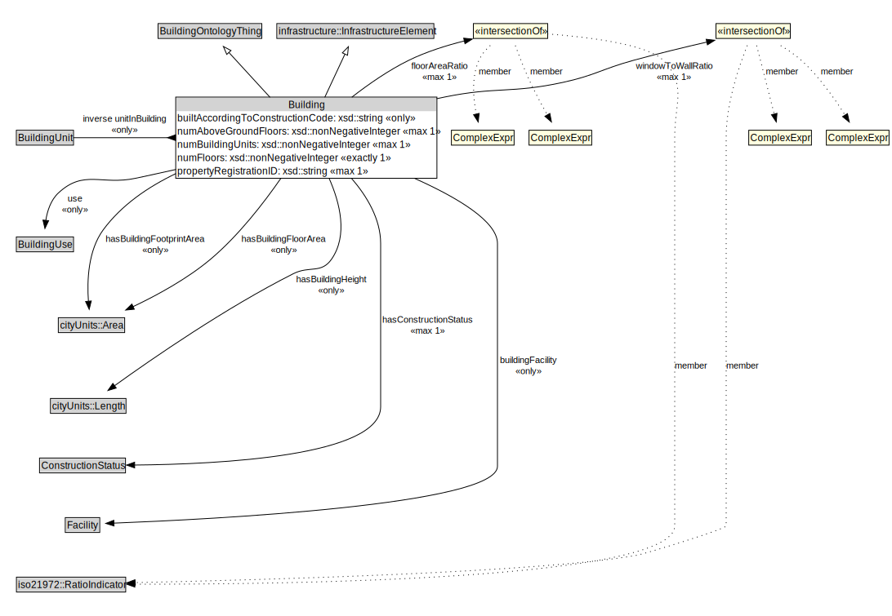

# Building

<a href="../../diagrams/Building__Building.dot.svg">Open interactive Building diagram</a>

## Formalization for Building

| Property | Constraint |
|----------|------------|
| buildingFacility | all Facility |
| builtAccordingToConstructionCode | all xsd::string |
| floorAreaRatio | max 1 owl::Thing |
| hasBuildingFloorArea | all cityUnits::Area |
| hasBuildingFootprintArea | all cityUnits::Area |
| hasBuildingHeight | all cityUnits::Length |
| hasConstructionStatus | max 1 owl::Thing |
| inverse unitInBuilding | all BuildingUnit |
| numAboveGroundFloors | max 1 owl::Thing |
| numBuildingUnits | max 1 owl::Thing |
| numFloors | exactly 1 owl::Thing |
| propertyRegistrationID | max 1 owl::Thing |
| subClassOf | BuildingOntologyThing |
| subClassOf | infrastructure::InfrastructureElement |
| use | all BuildingUse |
| windowToWallRatio | max 1 owl::Thing |

