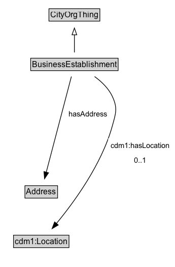

# BusinessEstablishment

Business Establishment: A Business establishment is a physical location where an Organization conducts business.

## Diagram

=== "SVG (interactive)"

    <!-- Generated by graphviz version 14.1.3 (20260303.0454)
     -->
    <!-- Pages: 1 -->
    <svg width="259pt" height="394pt"
     viewBox="0.00 0.00 259.00 394.00" xmlns="http://www.w3.org/2000/svg" xmlns:xlink="http://www.w3.org/1999/xlink">
    <g id="graph0" class="graph" transform="scale(1 1) rotate(0) translate(4 390)">
    <polygon fill="white" stroke="none" points="-4,4 -4,-390 254.95,-390 254.95,4 -4,4"/>
    <g id="clust3" class="cluster">
    <title>cluster_associated</title>
    </g>
    <!-- CityOrgThing -->
    <g id="node1" class="node">
    <title>CityOrgThing</title>
    <g id="a_node1"><a xlink:href="../CityOrgThing" xlink:title="&lt;TABLE&gt;">
    <polygon fill="lightgray" stroke="none" points="69.38,-359.88 69.38,-376.12 142.62,-376.12 142.62,-359.88 69.38,-359.88"/>
    <text xml:space="preserve" text-anchor="start" x="70.38" y="-363.88" font-family="Arial" font-size="12.00">CityOrgThing</text>
    <polygon fill="none" stroke="black" points="68.38,-358.88 68.38,-377.12 143.62,-377.12 143.62,-358.88 68.38,-358.88"/>
    </a>
    </g>
    </g>
    <!-- BusinessEstablishment -->
    <g id="node2" class="node">
    <title>BusinessEstablishment</title>
    <g id="a_node2"><a xlink:href="../BusinessEstablishment" xlink:title="&lt;TABLE&gt;">
    <polygon fill="lightgray" stroke="none" points="42.38,-286.88 42.38,-303.12 169.62,-303.12 169.62,-286.88 42.38,-286.88"/>
    <text xml:space="preserve" text-anchor="start" x="43.38" y="-290.88" font-family="Arial" font-size="12.00">BusinessEstablishment</text>
    <polygon fill="none" stroke="black" points="41.38,-285.88 41.38,-304.12 170.62,-304.12 170.62,-285.88 41.38,-285.88"/>
    </a>
    </g>
    </g>
    <!-- BusinessEstablishment&#45;&gt;CityOrgThing -->
    <g id="edge1" class="edge">
    <title>BusinessEstablishment&#45;&gt;CityOrgThing</title>
    <path fill="none" stroke="black" d="M106,-312.71C106,-320.47 106,-329.92 106,-338.74"/>
    <polygon fill="none" stroke="black" points="102.5,-338.66 106,-348.66 109.5,-338.66 102.5,-338.66"/>
    </g>
    <!-- Invis -->
    <!-- BusinessEstablishment&#45;&gt;Invis -->
    <!-- Address -->
    <g id="node4" class="node">
    <title>Address</title>
    <g id="a_node4"><a xlink:href="../Address" xlink:title="&lt;TABLE&gt;">
    <polygon fill="lightgray" stroke="none" points="33.88,-98.88 33.88,-115.12 80.12,-115.12 80.12,-98.88 33.88,-98.88"/>
    <text xml:space="preserve" text-anchor="start" x="34.88" y="-102.88" font-family="Arial" font-size="12.00">Address</text>
    <polygon fill="none" stroke="black" points="32.88,-97.88 32.88,-116.12 81.12,-116.12 81.12,-97.88 32.88,-97.88"/>
    </a>
    </g>
    </g>
    <!-- BusinessEstablishment&#45;&gt;Address -->
    <g id="edge6" class="edge">
    <title>BusinessEstablishment&#45;&gt;Address</title>
    <path fill="none" stroke="black" d="M101.57,-277.17C93.13,-245.15 74.71,-175.21 64.38,-136.03"/>
    <polygon fill="black" stroke="black" points="67.78,-135.17 61.85,-126.39 61.01,-136.96 67.78,-135.17"/>
    <polygon fill="white" stroke="none" points="93.3,-211.25 93.3,-232.75 158.3,-232.75 158.3,-211.25 93.3,-211.25"/>
    <text xml:space="preserve" text-anchor="start" x="97.3" y="-218.25" font-family="Arial" font-size="11.00">hasAddress</text>
    </g>
    <!-- cdm1_Location -->
    <g id="node5" class="node">
    <title>cdm1_Location</title>
    <g id="a_node5"><a xlink:href="https://w3id.org/citydata/part1/v1/Location" xlink:title="&lt;TABLE&gt;">
    <polygon fill="lightgray" stroke="none" points="17,-25.88 17,-42.12 97,-42.12 97,-25.88 17,-25.88"/>
    <text xml:space="preserve" text-anchor="start" x="18" y="-29.88" font-family="Arial" font-size="12.00">cdm1:Location</text>
    <polygon fill="none" stroke="black" points="16,-24.88 16,-43.12 98,-43.12 98,-24.88 16,-24.88"/>
    </a>
    </g>
    </g>
    <!-- BusinessEstablishment&#45;&gt;cdm1_Location -->
    <g id="edge5" class="edge">
    <title>BusinessEstablishment&#45;&gt;cdm1_Location</title>
    <path fill="none" stroke="black" d="M135.87,-277.12C146.12,-269.64 156.41,-259.83 162,-248 170.36,-230.32 167.22,-222.85 162,-204 146.31,-147.34 105.07,-91.32 79.19,-60.13"/>
    <polygon fill="black" stroke="black" points="82.12,-58.18 72.99,-52.8 76.78,-62.7 82.12,-58.18"/>
    <polygon fill="white" stroke="none" points="155.95,-143 155.95,-186 250.95,-186 250.95,-143 155.95,-143"/>
    <text xml:space="preserve" text-anchor="start" x="159.95" y="-171.5" font-family="Arial" font-size="11.00">cdm1:hasLocation</text>
    <text xml:space="preserve" text-anchor="start" x="194.45" y="-150" font-family="Arial" font-size="11.00">0..1</text>
    </g>
    <!-- Invis&#45;&gt;Address -->
    <!-- Address&#45;&gt;cdm1_Location -->
    </g>
    </svg>

=== "PNG"

    

## Formalization for BusinessEstablishment

| Property | Constraint |
|----------|------------|
| [cdm1:hasLocation](https://w3id.org/citydata/part1/v1/hasLocation) | max 1 |
| [cdm1:hasLocation](https://w3id.org/citydata/part1/v1/hasLocation) | max 1 [cdm1:Location](https://w3id.org/citydata/part1/v1/Location) |
| [hasAddress](../properties/hasAddress.md) | only [Address](https://w3id.org/citydata/part2/v1/Address) |
| subClassOf | [CityOrgThing](CityOrgThing.md) |

