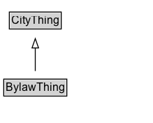

# BylawThing

Added for organizational purposes, to identify classes defined in the Bylaw ontology.

## Diagram

=== "SVG (interactive)"

    <!-- Generated by graphviz version 14.1.3 (20260303.0454)
     -->
    <!-- Pages: 1 -->
    <svg width="164pt" height="132pt"
     viewBox="0.00 0.00 164.00 132.00" xmlns="http://www.w3.org/2000/svg" xmlns:xlink="http://www.w3.org/1999/xlink">
    <g id="graph0" class="graph" transform="scale(1 1) rotate(0) translate(4 128)">
    <polygon fill="white" stroke="none" points="-4,4 -4,-128 159.88,-128 159.88,4 -4,4"/>
    <g id="clust3" class="cluster">
    <title>cluster_associated</title>
    </g>
    <!-- CityThing -->
    <g id="node1" class="node">
    <title>CityThing</title>
    <g id="a_node1"><a xlink:href="../CityThing" xlink:title="&lt;TABLE&gt;">
    <polygon fill="lightgray" stroke="none" points="7,-97.88 7,-114.12 60.75,-114.12 60.75,-97.88 7,-97.88"/>
    <text xml:space="preserve" text-anchor="start" x="8" y="-101.88" font-family="Arial" font-size="12.00">CityThing</text>
    <polygon fill="none" stroke="black" points="6,-96.88 6,-115.12 61.75,-115.12 61.75,-96.88 6,-96.88"/>
    </a>
    </g>
    </g>
    <!-- BylawThing -->
    <g id="node2" class="node">
    <title>BylawThing</title>
    <g id="a_node2"><a xlink:href="../BylawThing" xlink:title="&lt;TABLE&gt;">
    <polygon fill="lightgray" stroke="none" points="1,-25.88 1,-42.12 66.75,-42.12 66.75,-25.88 1,-25.88"/>
    <text xml:space="preserve" text-anchor="start" x="2" y="-29.88" font-family="Arial" font-size="12.00">BylawThing</text>
    <polygon fill="none" stroke="black" points="0,-24.88 0,-43.12 67.75,-43.12 67.75,-24.88 0,-24.88"/>
    </a>
    </g>
    </g>
    <!-- BylawThing&#45;&gt;CityThing -->
    <g id="edge1" class="edge">
    <title>BylawThing&#45;&gt;CityThing</title>
    <path fill="none" stroke="black" d="M33.88,-51.79C33.88,-59.25 33.88,-68.24 33.88,-76.69"/>
    <polygon fill="none" stroke="black" points="30.38,-76.54 33.88,-86.54 37.38,-76.54 30.38,-76.54"/>
    </g>
    <!-- Invis -->
    </g>
    </svg>

=== "PNG"

    

## Specializations of BylawThing

| Class | Description |
|-------|-------------|
| [Amending Bylaw](AmendingBylaw.md) | An Amending Bylaw is a type of Bylaw that modifies or updates an existing bylaw. |
| [Bylaw](Bylaw.md) | A bylaw is a law that is passed by a lower hierarchical entity that gains its authority from a government authority. |
| [Bylaw Type Code](BylawTypeCode.md) | A code identifying whether a bylaw is a main, amending, or revision bylaw. |
| [Clause](Clause.md) | A Clause is a statement of a rule, provision, requirement, etc. that is part of the body of the Law, or its schedules, penalties, etc. |
| [Definition](Definition.md) | A definition is a statement that explains the meaning of a term or concept as used within the domain object (e.g., a document). |
| [Law](Law.md) | A Law is an legally enforceable rule. |
| [Legislation Legal Force Code](LegislationLegalForceCode.md) | A code identifying whether a law is in force, not in force, or partially in force. |
| [Main Bylaw](MainBylaw.md) | A Main Bylaw is a legally enforceable rule that serves as the primary legislative document for a law within a Jurisdictional Area. |
| [Revision Bylaw](RevisionBylaw.md) | A RevisionBylaw is a bylaw that amends an existing bylaw. |
| [Schedule](Schedule.md) | A Schedule is a component of a bylaw that outlines specific provisions, terms, or details related to the main content of the document. |

## Formalization for BylawThing

| Property | Constraint |
|----------|------------|
| subClassOf | [CityThing](CityThing.md) |

