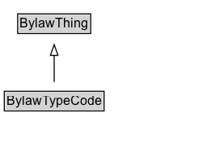

# BylawTypeCode

A code identifying whether a bylaw is a main, amending, or revision bylaw.

## Diagram

=== "SVG (interactive)"

    <!-- Generated by graphviz version 14.1.3 (20260303.0454)
     -->
    <!-- Pages: 1 -->
    <svg width="188pt" height="132pt"
     viewBox="0.00 0.00 188.00 132.00" xmlns="http://www.w3.org/2000/svg" xmlns:xlink="http://www.w3.org/1999/xlink">
    <g id="graph0" class="graph" transform="scale(1 1) rotate(0) translate(4 128)">
    <polygon fill="white" stroke="none" points="-4,4 -4,-128 184.25,-128 184.25,4 -4,4"/>
    <g id="clust3" class="cluster">
    <title>cluster_associated</title>
    </g>
    <!-- BylawThing -->
    <g id="node1" class="node">
    <title>BylawThing</title>
    <g id="a_node1"><a xlink:href="../BylawThing" xlink:title="&lt;TABLE&gt;">
    <polygon fill="lightgray" stroke="none" points="13.38,-97.88 13.38,-114.12 79.12,-114.12 79.12,-97.88 13.38,-97.88"/>
    <text xml:space="preserve" text-anchor="start" x="14.38" y="-101.88" font-family="Arial" font-size="12.00">BylawThing</text>
    <polygon fill="none" stroke="black" points="12.38,-96.88 12.38,-115.12 80.12,-115.12 80.12,-96.88 12.38,-96.88"/>
    </a>
    </g>
    </g>
    <!-- BylawTypeCode -->
    <g id="node2" class="node">
    <title>BylawTypeCode</title>
    <g id="a_node2"><a xlink:href="../BylawTypeCode" xlink:title="&lt;TABLE&gt;">
    <polygon fill="lightgray" stroke="none" points="1,-25.88 1,-42.12 91.5,-42.12 91.5,-25.88 1,-25.88"/>
    <text xml:space="preserve" text-anchor="start" x="2" y="-29.88" font-family="Arial" font-size="12.00">BylawTypeCode</text>
    <polygon fill="none" stroke="black" points="0,-24.88 0,-43.12 92.5,-43.12 92.5,-24.88 0,-24.88"/>
    </a>
    </g>
    </g>
    <!-- BylawTypeCode&#45;&gt;BylawThing -->
    <g id="edge1" class="edge">
    <title>BylawTypeCode&#45;&gt;BylawThing</title>
    <path fill="none" stroke="black" d="M46.25,-51.79C46.25,-59.25 46.25,-68.24 46.25,-76.69"/>
    <polygon fill="none" stroke="black" points="42.75,-76.54 46.25,-86.54 49.75,-76.54 42.75,-76.54"/>
    </g>
    <!-- Invis -->
    </g>
    </svg>

=== "PNG"

    

## Formalization for BylawTypeCode

| Property | Constraint |
|----------|------------|
| subClassOf | [BylawThing](BylawThing.md) |

