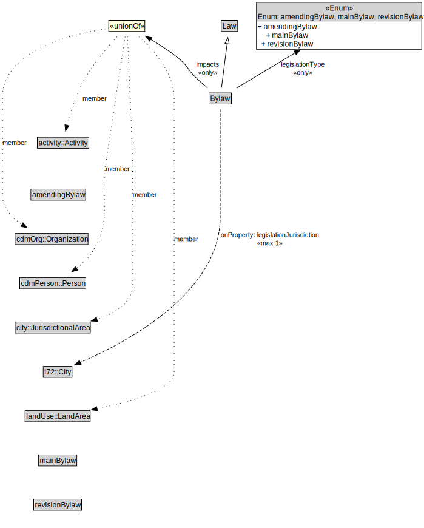

# Bylaw

<a href="../../diagrams/Bylaw__Bylaw.dot.svg">Open interactive Bylaw diagram</a>

## Specializations of Bylaw

| Class | Description |
|-------|-------------|
| [Amending Bylaw (Bylaw)](Bylaw__AmendingBylaw.md) |  |
| [Main Bylaw (Bylaw)](Bylaw__MainBylaw.md) |  |
| [Revision Bylaw (Bylaw)](Bylaw__RevisionBylaw.md) |  |

## Formalization for Bylaw

| Property | Constraint |
|----------|------------|
| impacts | all activity::Activity or cdmOrg::Organization or cdmPerson::Person or city::JurisdictionalArea or landUse::LandArea |
| legislationJurisdiction | max 1 owl::Thing |
| legislationType | all Enum: amendingBylaw, mainBylaw, revisionBylaw |
| subClassOf | Law |

