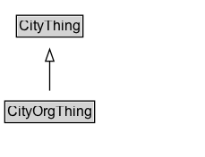

# CityOrgThing

Added for organizational purposes, to identify classes defined in the City Organization ontology.

## Diagram

=== "SVG (interactive)"

    <!-- Generated by graphviz version 14.1.3 (20260303.0454)
     -->
    <!-- Pages: 1 -->
    <svg width="172pt" height="132pt"
     viewBox="0.00 0.00 172.00 132.00" xmlns="http://www.w3.org/2000/svg" xmlns:xlink="http://www.w3.org/1999/xlink">
    <g id="graph0" class="graph" transform="scale(1 1) rotate(0) translate(4 128)">
    <polygon fill="white" stroke="none" points="-4,4 -4,-128 167.62,-128 167.62,4 -4,4"/>
    <g id="clust3" class="cluster">
    <title>cluster_associated</title>
    </g>
    <!-- CityThing -->
    <g id="node1" class="node">
    <title>CityThing</title>
    <g id="a_node1"><a xlink:href="../CityThing" xlink:title="&lt;TABLE&gt;">
    <polygon fill="lightgray" stroke="none" points="10.75,-97.88 10.75,-114.12 64.5,-114.12 64.5,-97.88 10.75,-97.88"/>
    <text xml:space="preserve" text-anchor="start" x="11.75" y="-101.88" font-family="Arial" font-size="12.00">CityThing</text>
    <polygon fill="none" stroke="black" points="9.75,-96.88 9.75,-115.12 65.5,-115.12 65.5,-96.88 9.75,-96.88"/>
    </a>
    </g>
    </g>
    <!-- CityOrgThing -->
    <g id="node2" class="node">
    <title>CityOrgThing</title>
    <g id="a_node2"><a xlink:href="../CityOrgThing" xlink:title="&lt;TABLE&gt;">
    <polygon fill="lightgray" stroke="none" points="1,-25.88 1,-42.12 74.25,-42.12 74.25,-25.88 1,-25.88"/>
    <text xml:space="preserve" text-anchor="start" x="2" y="-29.88" font-family="Arial" font-size="12.00">CityOrgThing</text>
    <polygon fill="none" stroke="black" points="0,-24.88 0,-43.12 75.25,-43.12 75.25,-24.88 0,-24.88"/>
    </a>
    </g>
    </g>
    <!-- CityOrgThing&#45;&gt;CityThing -->
    <g id="edge1" class="edge">
    <title>CityOrgThing&#45;&gt;CityThing</title>
    <path fill="none" stroke="black" d="M37.62,-51.79C37.62,-59.25 37.62,-68.24 37.62,-76.69"/>
    <polygon fill="none" stroke="black" points="34.13,-76.54 37.63,-86.54 41.13,-76.54 34.13,-76.54"/>
    </g>
    <!-- Invis -->
    </g>
    </svg>

=== "PNG"

    

## Specializations of CityOrgThing

| Class | Description |
|-------|-------------|
| [Business Establishment](BusinessEstablishment.md) | Business Establishment: A Business establishment is a physical location where an Organization conducts business. |
| [Compensation](Compensation.md) | A compensation is a generalization of monetary compensation received for employment. |
| [Employment](Employment.md) | Employment is a type of Organizational membership in which the Agent receives monetary compensation for the value that they provide to the Organization. |
| [Employment Status](EmploymentStatus.md) | Employment Status is a type of Code that describes the employment status of an Agent within an Organization. |
| [For Profit Organization](ForProfitOrganization.md) | A for-profit organization is an organization that operates with the primary goal of generating profit for its owners or shareholders. |
| [Goal](Goal.md) | A goal represents some state or complex states, and allows for the representation of various groups' responsibilities. |
| [Government Organization](GovernmentOrganization.md) |  |
| [Industry Type](IndustryType.md) | Industry Type is a type of Code that describes the industry sector of a business establishment. |
| [Non Profit Organization](NonProfitOrganization.md) | A NonProfitOrganization is an non-governmental organization that operates for purposes other than generating profit. |
| [Occupation](Occupation.md) | Occupation describes the work performed by some Employee. |
| [Operation](Operation.md) | An Operation defines the regular opening hours of an Organization or Infrastructure Element. |
| [Organization](Organization.md) | An Organization defined broadly as a formal or semi-formal group for which structure and behaviour are defined. |
| [Organization Agent](OrganizationAgent.md) | Member of an organization |
| [Role](Role.md) | A Role has a single, possibly complex, Goal. |
| [Salary](Salary.md) | A Salary is a form of compensation paid to an employee and is defined on an annual basis. |
| [Wage](Wage.md) | A Wage is a form of compensation paid to an employee and is defined on an hourly basis. |

## Formalization for CityOrgThing

| Property | Constraint |
|----------|------------|
| subClassOf | [CityThing](CityThing.md) |

