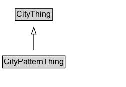

# CityPatternThing

Added for organizational purposes, to identify classes defined in the City Services part of the City Data Model.

## Diagram

=== "SVG (interactive)"

    <!-- Generated by graphviz version 14.1.3 (20260303.0454)
     -->
    <!-- Pages: 1 -->
    <svg width="190pt" height="132pt"
     viewBox="0.00 0.00 190.00 132.00" xmlns="http://www.w3.org/2000/svg" xmlns:xlink="http://www.w3.org/1999/xlink">
    <g id="graph0" class="graph" transform="scale(1 1) rotate(0) translate(4 128)">
    <polygon fill="white" stroke="none" points="-4,4 -4,-128 186,-128 186,4 -4,4"/>
    <g id="clust3" class="cluster">
    <title>cluster_associated</title>
    </g>
    <!-- CityThing -->
    <g id="node1" class="node">
    <title>CityThing</title>
    <g id="a_node1"><a xlink:href="../CityThing" xlink:title="&lt;TABLE&gt;">
    <polygon fill="lightgray" stroke="none" points="20.12,-97.88 20.12,-114.12 73.88,-114.12 73.88,-97.88 20.12,-97.88"/>
    <text xml:space="preserve" text-anchor="start" x="21.12" y="-101.88" font-family="Arial" font-size="12.00">CityThing</text>
    <polygon fill="none" stroke="black" points="19.12,-96.88 19.12,-115.12 74.88,-115.12 74.88,-96.88 19.12,-96.88"/>
    </a>
    </g>
    </g>
    <!-- CityPatternThing -->
    <g id="node2" class="node">
    <title>CityPatternThing</title>
    <g id="a_node2"><a xlink:href="../CityPatternThing" xlink:title="&lt;TABLE&gt;">
    <polygon fill="lightgray" stroke="none" points="1,-25.88 1,-42.12 93,-42.12 93,-25.88 1,-25.88"/>
    <text xml:space="preserve" text-anchor="start" x="2" y="-29.88" font-family="Arial" font-size="12.00">CityPatternThing</text>
    <polygon fill="none" stroke="black" points="0,-24.88 0,-43.12 94,-43.12 94,-24.88 0,-24.88"/>
    </a>
    </g>
    </g>
    <!-- CityPatternThing&#45;&gt;CityThing -->
    <g id="edge1" class="edge">
    <title>CityPatternThing&#45;&gt;CityThing</title>
    <path fill="none" stroke="black" d="M47,-51.79C47,-59.25 47,-68.24 47,-76.69"/>
    <polygon fill="none" stroke="black" points="43.5,-76.54 47,-86.54 50.5,-76.54 43.5,-76.54"/>
    </g>
    <!-- Invis -->
    </g>
    </svg>

=== "PNG"

    

## Specializations of CityPatternThing

| Class | Description |
|-------|-------------|
| [City](City.md) | A City is a specialization of a Jurisdictional Area that is formally identified as such. |
| [City Administrative Area](CityAdministrativeArea.md) | Jurisdictional Area that has been identified for use by a City to reflect its unique areas such as districts, wards, neighbourhoods, or prefectures.  |
| [Jurisdictional Area](JurisdictionalArea.md) | A Jurisdictional Area is an abstract entity that is characterized not only by its location, but by the objects that occupy it (persons, buildings, etc), the governing body(s) it is subject to, and the activities that occur within it. |
| [Transport Infrastructure Thing](TransportInfrastructureThing.md) | Added for organizational purposes, to identify classes defined in the Transport Infrastructure Pattern ontology. |

## Formalization for CityPatternThing

| Property | Constraint |
|----------|------------|
| subClassOf | [CityThing](CityThing.md) |

