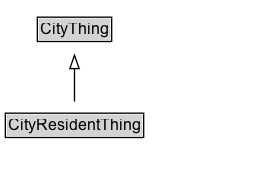

# CityResidentThing

Added for organizational purposes, to identify classes defined in the City Resident ontology.

## Diagram

=== "SVG (interactive)"

    <!-- Generated by graphviz version 14.1.3 (20260303.0454)
     -->
    <!-- Pages: 1 -->
    <svg width="200pt" height="132pt"
     viewBox="0.00 0.00 200.00 132.00" xmlns="http://www.w3.org/2000/svg" xmlns:xlink="http://www.w3.org/1999/xlink">
    <g id="graph0" class="graph" transform="scale(1 1) rotate(0) translate(4 128)">
    <polygon fill="white" stroke="none" points="-4,4 -4,-128 195.88,-128 195.88,4 -4,4"/>
    <g id="clust3" class="cluster">
    <title>cluster_associated</title>
    </g>
    <!-- CityThing -->
    <g id="node1" class="node">
    <title>CityThing</title>
    <g id="a_node1"><a xlink:href="../CityThing" xlink:title="&lt;TABLE&gt;">
    <polygon fill="lightgray" stroke="none" points="25,-97.88 25,-114.12 78.75,-114.12 78.75,-97.88 25,-97.88"/>
    <text xml:space="preserve" text-anchor="start" x="26" y="-101.88" font-family="Arial" font-size="12.00">CityThing</text>
    <polygon fill="none" stroke="black" points="24,-96.88 24,-115.12 79.75,-115.12 79.75,-96.88 24,-96.88"/>
    </a>
    </g>
    </g>
    <!-- CityResidentThing -->
    <g id="node2" class="node">
    <title>CityResidentThing</title>
    <g id="a_node2"><a xlink:href="../CityResidentThing" xlink:title="&lt;TABLE&gt;">
    <polygon fill="lightgray" stroke="none" points="1,-25.88 1,-42.12 102.75,-42.12 102.75,-25.88 1,-25.88"/>
    <text xml:space="preserve" text-anchor="start" x="2" y="-29.88" font-family="Arial" font-size="12.00">CityResidentThing</text>
    <polygon fill="none" stroke="black" points="0,-24.88 0,-43.12 103.75,-43.12 103.75,-24.88 0,-24.88"/>
    </a>
    </g>
    </g>
    <!-- CityResidentThing&#45;&gt;CityThing -->
    <g id="edge1" class="edge">
    <title>CityResidentThing&#45;&gt;CityThing</title>
    <path fill="none" stroke="black" d="M51.88,-51.79C51.88,-59.25 51.88,-68.24 51.88,-76.69"/>
    <polygon fill="none" stroke="black" points="48.38,-76.54 51.88,-86.54 55.38,-76.54 48.38,-76.54"/>
    </g>
    <!-- Invis -->
    </g>
    </svg>

=== "PNG"

    

## Specializations of CityResidentThing

| Class | Description |
|-------|-------------|
| [City Resident](CityResident.md) | A City Resident is a Person who satisfies the requirements of being a city resident for the particular City. |
| [Controlled Entity](ControlledEntity.md) | A controlled entity is an entity that is subject to control by another entity. |
| [Entity Operation](EntityOperation.md) | Activity of operating an Organization by City Resident. |
| [Entity Ownership](EntityOwnership.md) | Activity of owning a Building, Land Area, or Organization by City Resident. |
| [Home Type](HomeType.md) | Home Type is a type of Code that describes the type of a Residence. |
| [Residence](Residence.md) |  |
| [Residential Relationship](ResidentialRelationship.md) | A ResidentialRelationship defines the relationship of a Resident to a Residence. |

## Formalization for CityResidentThing

| Property | Constraint |
|----------|------------|
| subClassOf | [CityThing](CityThing.md) |

