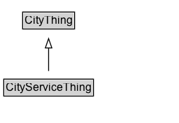

# CityServiceThing

Added for organizational purposes, to identify classes defined in the City Service ontology.

## Diagram

=== "SVG (interactive)"

    <!-- Generated by graphviz version 14.1.3 (20260303.0454)
     -->
    <!-- Pages: 1 -->
    <svg width="192pt" height="132pt"
     viewBox="0.00 0.00 192.00 132.00" xmlns="http://www.w3.org/2000/svg" xmlns:xlink="http://www.w3.org/1999/xlink">
    <g id="graph0" class="graph" transform="scale(1 1) rotate(0) translate(4 128)">
    <polygon fill="white" stroke="none" points="-4,4 -4,-128 188.12,-128 188.12,4 -4,4"/>
    <g id="clust3" class="cluster">
    <title>cluster_associated</title>
    </g>
    <!-- CityThing -->
    <g id="node1" class="node">
    <title>CityThing</title>
    <g id="a_node1"><a xlink:href="../CityThing" xlink:title="&lt;TABLE&gt;">
    <polygon fill="lightgray" stroke="none" points="21.25,-97.88 21.25,-114.12 75,-114.12 75,-97.88 21.25,-97.88"/>
    <text xml:space="preserve" text-anchor="start" x="22.25" y="-101.88" font-family="Arial" font-size="12.00">CityThing</text>
    <polygon fill="none" stroke="black" points="20.25,-96.88 20.25,-115.12 76,-115.12 76,-96.88 20.25,-96.88"/>
    </a>
    </g>
    </g>
    <!-- CityServiceThing -->
    <g id="node2" class="node">
    <title>CityServiceThing</title>
    <g id="a_node2"><a xlink:href="../CityServiceThing" xlink:title="&lt;TABLE&gt;">
    <polygon fill="lightgray" stroke="none" points="1,-25.88 1,-42.12 95.25,-42.12 95.25,-25.88 1,-25.88"/>
    <text xml:space="preserve" text-anchor="start" x="2" y="-29.88" font-family="Arial" font-size="12.00">CityServiceThing</text>
    <polygon fill="none" stroke="black" points="0,-24.88 0,-43.12 96.25,-43.12 96.25,-24.88 0,-24.88"/>
    </a>
    </g>
    </g>
    <!-- CityServiceThing&#45;&gt;CityThing -->
    <g id="edge1" class="edge">
    <title>CityServiceThing&#45;&gt;CityThing</title>
    <path fill="none" stroke="black" d="M48.12,-51.79C48.12,-59.25 48.12,-68.24 48.12,-76.69"/>
    <polygon fill="none" stroke="black" points="44.63,-76.54 48.13,-86.54 51.63,-76.54 44.63,-76.54"/>
    </g>
    <!-- Invis -->
    </g>
    </svg>

=== "PNG"

    

## Specializations of CityServiceThing

| Class | Description |
|-------|-------------|
| [Catchment Area Type](CatchmentAreaType.md) | Catchment Area Type is a type of Code that describes the type of catchment area that stakeholders represent |
| [Impact Direction](ImpactDirection.md) | Impact Direction is a type of Code that describes the direction of impact of an event or action. |
| [Importance](Importance.md) | Importance is a type of Code that describes the level of importance of an event or action. |
| [Input](Input.md) | Input defines the resources and the stakeholders that are needed for an Activity. |
| [Outcome](Outcome.md) | Outcomes are what stakeholders experience as a result of a Program or Service. |
| [Output](Output.md) | Output is a quantitative summary of an activity. |
| [Program](Program.md) | A program is a major city initiative to address the needs of constituents (citizens, clients). A Program defines a set of services that focus on achieving a shared set of Outcomes. |
| [Service](Service.md) | A Program is composed of one or more Services. |
| [Stakeholder](Stakeholder.md) | A Stakeholder is an Organization or Person that has an interest in a Program or Service. |

## Formalization for CityServiceThing

| Property | Constraint |
|----------|------------|
| subClassOf | [CityThing](CityThing.md) |

