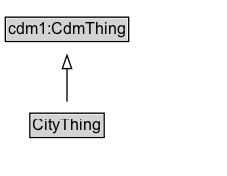

# CityThing

Added for organizational purposes, to identify classes defined for the city-level CDM ontology.

## Diagram

=== "SVG (interactive)"

    <!-- Generated by graphviz version 14.1.3 (20260303.0454)
     -->
    <!-- Pages: 1 -->
    <svg width="170pt" height="132pt"
     viewBox="0.00 0.00 170.00 132.00" xmlns="http://www.w3.org/2000/svg" xmlns:xlink="http://www.w3.org/1999/xlink">
    <g id="graph0" class="graph" transform="scale(1 1) rotate(0) translate(4 128)">
    <polygon fill="white" stroke="none" points="-4,4 -4,-128 166.25,-128 166.25,4 -4,4"/>
    <g id="clust3" class="cluster">
    <title>cluster_associated</title>
    </g>
    <!-- cdm1_CdmThing -->
    <g id="node1" class="node">
    <title>cdm1_CdmThing</title>
    <g id="a_node1"><a xlink:href="https://w3id.org/citydata/part1/v1/CdmThing" xlink:title="&lt;TABLE&gt;">
    <polygon fill="lightgray" stroke="none" points="1,-97.88 1,-114.12 91.5,-114.12 91.5,-97.88 1,-97.88"/>
    <text xml:space="preserve" text-anchor="start" x="2" y="-101.88" font-family="Arial" font-size="12.00">cdm1:CdmThing</text>
    <polygon fill="none" stroke="black" points="0,-96.88 0,-115.12 92.5,-115.12 92.5,-96.88 0,-96.88"/>
    </a>
    </g>
    </g>
    <!-- CityThing -->
    <g id="node2" class="node">
    <title>CityThing</title>
    <g id="a_node2"><a xlink:href="../CityThing" xlink:title="&lt;TABLE&gt;">
    <polygon fill="lightgray" stroke="none" points="19.38,-25.88 19.38,-42.12 73.12,-42.12 73.12,-25.88 19.38,-25.88"/>
    <text xml:space="preserve" text-anchor="start" x="20.38" y="-29.88" font-family="Arial" font-size="12.00">CityThing</text>
    <polygon fill="none" stroke="black" points="18.38,-24.88 18.38,-43.12 74.12,-43.12 74.12,-24.88 18.38,-24.88"/>
    </a>
    </g>
    </g>
    <!-- CityThing&#45;&gt;cdm1_CdmThing -->
    <g id="edge1" class="edge">
    <title>CityThing&#45;&gt;cdm1_CdmThing</title>
    <path fill="none" stroke="black" d="M46.25,-51.79C46.25,-59.25 46.25,-68.24 46.25,-76.69"/>
    <polygon fill="none" stroke="black" points="42.75,-76.54 46.25,-86.54 49.75,-76.54 42.75,-76.54"/>
    </g>
    <!-- Invis -->
    </g>
    </svg>

=== "PNG"

    

## Specializations of CityThing

| Class | Description |
|-------|-------------|
| [Address](Address.md) | Address is the main concept for a contact.  It has been designed to represent any type of address in the world, including India and the UK.  For example, the property hasBuilding is important in many UK and Indian addresses to further identify the person or business location. Street information is divided into separate properties to fully identify direction (hasStreetDirection), Type (hasStreetType), etc. |
| [Address Type](AddressType.md) | Address Type is a type of Code that describes the type of address, such as residential, business, or mailing. |
| [Alert](Alert.md) | An Alert can be used to notify people of important information. |
| [Alert Thing](AlertThing.md) | Added for organizational purposes, to identify classes defined for the Alert Pattern. |
| [Amending Bylaw](AmendingBylaw.md) | An Amending Bylaw is a type of Bylaw that modifies or updates an existing bylaw. |
| [Area Ratio](AreaRatio.md) |  |
| [Bridge](Bridge.md) | A Bridge is a Infrastructure Element that enables travel over some obstacle or area. It may contain some Road Segments or Rail Line Segments. |
| [Bridge Segment](BridgeSegment.md) |  |
| [Building](Building.md) | A Building is a type of Infrastructure Element that is a structure with a roof and walls, such as a house, school, or factory. The location of a Building may change due to construction, but the Parcel/Lot of land it is located on cannot (i.e., moving an entire building results in a change in object instance).  |
| [Building](Building.md) | A Building is a type of Infrastructure Element that is a structure with a roof and walls, such as a house, school, or factory. The location of a Building may change due to construction, but the Parcel/Lot of land it is located on cannot (i.e., moving an entire building results in a change in object instance).  |
| [Building Thing](BuildingThing.md) | Added for organizational purposes, to identify classes defined in the Building ontology. |
| [Building Unit](BuildingUnit.md) | A part of a Building which may be occupied by some Persons or Organization. |
| [Building Unit](BuildingUnit.md) | A part of a Building which may be occupied by some Persons or Organization. |
| [Building Use](BuildingUse.md) | Building Use is a type of Code that describes the use or function of a Building |
| [Business Establishment](BusinessEstablishment.md) | Business Establishment: A Business establishment is a physical location where an Organization conducts business. |
| [Bylaw](Bylaw.md) | A bylaw is a law that is passed by a lower hierarchical entity that gains its authority from a government authority. |
| [Bylaw Thing](BylawThing.md) | Added for organizational purposes, to identify classes defined in the Bylaw ontology. |
| [Bylaw Type Code](BylawTypeCode.md) | A code identifying whether a bylaw is a main, amending, or revision bylaw. |
| [Catchment Area Type](CatchmentAreaType.md) | Catchment Area Type is a type of Code that describes the type of catchment area that stakeholders represent |
| [Citizenship](Citizenship.md) | Citizenship is a type of City Thing that indicates the country of citizenship for a person during a specific period. |
| [City](City.md) | A City is a specialization of a Jurisdictional Area that is formally identified as such. |
| [City Administrative Area](CityAdministrativeArea.md) | Jurisdictional Area that has been identified for use by a City to reflect its unique areas such as districts, wards, neighbourhoods, or prefectures.  |
| [City Org Thing](CityOrgThing.md) | Added for organizational purposes, to identify classes defined in the City Organization ontology. |
| [City Pattern Thing](CityPatternThing.md) | Added for organizational purposes, to identify classes defined in the City Services part of the City Data Model. |
| [City Resident](CityResident.md) | A City Resident is a Person who satisfies the requirements of being a city resident for the particular City. |
| [City Resident](CityResident.md) | A City Resident is a Person who satisfies the requirements of being a city resident for the particular City. |
| [City Resident Thing](CityResidentThing.md) | Added for organizational purposes, to identify classes defined in the City Resident ontology. |
| [City Service Thing](CityServiceThing.md) | Added for organizational purposes, to identify classes defined in the City Service ontology. |
| [Clause](Clause.md) | A Clause is a statement of a rule, provision, requirement, etc. that is part of the body of the Law, or its schedules, penalties, etc. |
| [Code](Code.md) | A code represents a possible set of values for a property, according to some predefined system of values. |
| [Code Thing](CodeThing.md) | Added for organizational purposes, to identify classes defined in the Code ontology. |
| [Compensation](Compensation.md) | A compensation is a generalization of monetary compensation received for employment. |
| [Condition Precedent](ConditionPrecedent.md) | A condition precedent is a condition that must be met before a contract becomes effective. |
| [Construction Status](ConstructionStatus.md) | Construction Status is a type of Code that describes the construction status of a Building or Infrastructure Element. |
| [Contact Thing](ContactThing.md) | Added for organizational purposes, to identify classes defined in the Contact ontology. |
| [Contract](Contract.md) | A contract is a legally binding agreement between two or more parties. |
| [Contract Thing](ContractThing.md) | Added for organizational purposes, to identify classes defined in the Contract ontology. |
| [Contractual Commitment](ContractualCommitment.md) | A contractual commitment is a legally binding part of a contract that consists of a promise made by a party in relation to the contract. |
| [Contractual Definition](ContractualDefinition.md) | A contractual definition is a definition of a term used within a contract. |
| [Contractual Element](ContractualElement.md) | A contractual element is an element that forms part of a contract, such as a definition, condition, or commitment. |
| [Controlled Entity](ControlledEntity.md) | A controlled entity is an entity that is subject to control by another entity. |
| [Country](Country.md) | A Country is a specialization of a Jurisdictional Area that is formally identified as such. |
| [Definition](Definition.md) | A definition is a statement that explains the meaning of a term or concept as used within the domain object (e.g., a document). |
| [Education](Education.md) | Education is a type of Code that describes the educational background of a person. |
| [Employment](Employment.md) | Employment is a type of Organizational membership in which the Agent receives monetary compensation for the value that they provide to the Organization. |
| [Employment Status](EmploymentStatus.md) | Employment Status is a type of Code that describes the employment status of an Agent within an Organization. |
| [Entity Operation](EntityOperation.md) | Activity of operating an Organization by City Resident. |
| [Entity Ownership](EntityOwnership.md) | Activity of owning a Building, Land Area, or Organization by City Resident. |
| [Facility](Facility.md) | A facility is a physical location or structure that provides services or amenities to the public or a specific group of people. |
| [Facility](Facility.md) | A facility is a physical location or structure that provides services or amenities to the public or a specific group of people. |
| [For Profit Organization](ForProfitOrganization.md) | A for-profit organization is an organization that operates with the primary goal of generating profit for its owners or shareholders. |
| [Gender](Gender.md) | Gender is a type of Code that describes the gender identity of a person. |
| [Goal](Goal.md) | A goal represents some state or complex states, and allows for the representation of various groups' responsibilities. |
| [Government Organization](GovernmentOrganization.md) |  |
| [Home Type](HomeType.md) | Home Type is a type of Code that describes the type of a Residence. |
| [Household](Household.md) | A Household refers to a collection of persons occupying a shared place of residence. Households may or may not be comprised of family members. |
| [Household Thing](HouseholdThing.md) | Added for organizational purposes, to identify classes defined in the Household ontology. |
| [Id Type](IDType.md) | ID Type is a type of Code that describes the type of identification document issued to a person. |
| [Impact Direction](ImpactDirection.md) | Impact Direction is a type of Code that describes the direction of impact of an event or action. |
| [Importance](Importance.md) | Importance is a type of Code that describes the level of importance of an event or action. |
| [Industry Type](IndustryType.md) | Industry Type is a type of Code that describes the industry sector of a business establishment. |
| [Infrastructure Element](InfrastructureElement.md) | An Infrastructure Element is a generic representation of a city structure of interest. |
| [Infrastructure Thing](InfrastructureThing.md) | Added for organizational purposes, to identify classes defined in the Infrastructure pattern. |
| [Input](Input.md) | Input defines the resources and the stakeholders that are needed for an Activity. |
| [Jurisdictional Area](JurisdictionalArea.md) | A Jurisdictional Area is an abstract entity that is characterized not only by its location, but by the objects that occupy it (persons, buildings, etc), the governing body(s) it is subject to, and the activities that occur within it. |
| [Land Area](LandArea.md) | A Land Area is a defined geographic area of land. |
| [Land Use Classification](LandUseClassification.md) | Land Use Classification is a type of Code that describes the use of a Land Area. |
| [Land Use Thing](LandUseThing.md) | Added for organizational purposes, to identify classes defined in the Land Use ontology. |
| [Law](Law.md) | A Law is an legally enforceable rule. |
| [Legislation Legal Force Code](LegislationLegalForceCode.md) | A code identifying whether a law is in force, not in force, or partially in force. |
| [Main Bylaw](MainBylaw.md) | A Main Bylaw is a legally enforceable rule that serves as the primary legislative document for a law within a Jurisdictional Area. |
| [Name](Name.md) | A Name represents a formal name given to an entity and is a superclass for all more descriptive name types. |
| [Non Binding Term](NonBindingTerm.md) | A NonBindingTerm is a term in a contract that does not have legal force. |
| [Non Profit Organization](NonProfitOrganization.md) | A NonProfitOrganization is an non-governmental organization that operates for purposes other than generating profit. |
| [Occupation](Occupation.md) | Occupation describes the work performed by some Employee. |
| [Operation](Operation.md) | An Operation defines the regular opening hours of an Organization or Infrastructure Element. |
| [Organization](Organization.md) | An Organization defined broadly as a formal or semi-formal group for which structure and behaviour are defined. |
| [Organization Agent](OrganizationAgent.md) | Member of an organization |
| [Outcome](Outcome.md) | Outcomes are what stakeholders experience as a result of a Program or Service. |
| [Output](Output.md) | Output is a quantitative summary of an activity. |
| [Person](Person.md) | A Person is an individual human being. |
| [Person Id](PersonId.md) | Person ID is a type of City Thing that represents an identification document issued to a person by an authoritative body. |
| [Person Name](PersonName.md) |  |
| [Person Name](PersonName.md) |  |
| [Person Thing](PersonThing.md) | Added for organizational purposes, to identify classes defined in the Person ontology. |
| [Phone Number](PhoneNumber.md) | A PhoneNumber defines the complete international phone number and type of number. |
| [Phone Type](PhoneType.md) | A PhoneType defines the type of phone number. |
| [Program](Program.md) | A program is a major city initiative to address the needs of constituents (citizens, clients). A Program defines a set of services that focus on achieving a shared set of Outcomes. |
| [Rail Line](RailLine.md) | A Rail Line is a type of Travelled Way that describes a part of the physical transportation infrastructure that has been fitted with tracks to allow travel by trains and other sorts of rail vehicles. No distinction is made between Rail Line types at this level. |
| [Rail Link](RailLink.md) | A Rail Link is a type of Travelled Way Link that represents a length of RailLine. |
| [Rail Segment](RailSegment.md) | A Rail Segment is a type of Travelled Way Segment that represents part of a Rail Link. |
| [Representation](Representation.md) | Part of the Contract that specifies some assertions that are taken to be true at the time of the contract and serve to influence a party's decision to enter into the Contract. |
| [Residence](Residence.md) |  |
| [Residential Relationship](ResidentialRelationship.md) | A ResidentialRelationship defines the relationship of a Resident to a Residence. |
| [Revision Bylaw](RevisionBylaw.md) | A RevisionBylaw is a bylaw that amends an existing bylaw. |
| [Road](Road.md) | A Road is a type of Travelled Way that describes a part of the physical transport infrastructure that has been improved to allow travel by motor vehicles, persons, bicycles, or similar methods of conveyance. road vehicles. No distinction is made between Road types at this level. |
| [Road Link](RoadLink.md) | A Road Link is a type of Travelled Way Link that represents a length of Road. |
| [Road Network Type](RoadNetworkType.md) |  |
| [Road Segment](RoadSegment.md) | A Road Segment is a type of Travelled Way Segment that represents part of a Road Link. |
| [Role](Role.md) | A Role has a single, possibly complex, Goal. |
| [Salary](Salary.md) | A Salary is a form of compensation paid to an employee and is defined on an annual basis. |
| [Schedule](Schedule.md) | A Schedule is a component of a bylaw that outlines specific provisions, terms, or details related to the main content of the document. |
| [Service](Service.md) | A Program is composed of one or more Services. |
| [Sex](Sex.md) | Sex is a type of Code that describes the biological sex of a person. |
| [Skill](Skill.md) | Skill is a type of Code that describes a specific ability or competency of a person. |
| [Stakeholder](Stakeholder.md) | A Stakeholder is an Organization or Person that has an interest in a Program or Service. |
| [State](State.md) | A State is a political subdivision of a country. |
| [Street Direction](StreetDirection.md) | A StreetDirection defines the directional component of a street name. |
| [Street Type](StreetType.md) | A StreetType defines the type of street. |
| [Transport Infrastructure Thing](TransportInfrastructureThing.md) | Added for organizational purposes, to identify classes defined in the Transport Infrastructure Pattern ontology. |
| [Travelled Way](TravelledWay.md) | A Travelled Way is a type of Infrastructure Element that enables travel. |
| [Travelled Way Link](TravelledWayLink.md) | A Travelled Way Link represents a continuous length of a Travelled Way and is a type of Infrastructure Element that connects two or more Travelled Way Segments. |
| [Travelled Way Segment](TravelledWaySegment.md) | A Travelled Way Segment is a type of Infrastructure Element that represents part of a Travelled Way Link. |
| [Tunnel](Tunnel.md) | A Tunnel is a Infrastructure Element that enables travel through or underneath some obstacle or area. It may contain some Road or RailLine Segments. |
| [Tunnel Segment](TunnelSegment.md) | A Tunnel Segment is a type of Infrastructure Element that represents part of a Tunnel. |
| [Wage](Wage.md) | A Wage is a form of compensation paid to an employee and is defined on an hourly basis. |
| [Warranty](Warranty.md) | A Warranty is a contractual promise of some indemnification if an assertion made in the Contract is false. |
| [Year](Year.md) | Represents a year in the Gregorian calendar. |

## Formalization for CityThing

| Property | Constraint |
|----------|------------|
| subClassOf | [cdm1:CdmThing](https://w3id.org/citydata/part1/v1/CdmThing) |

