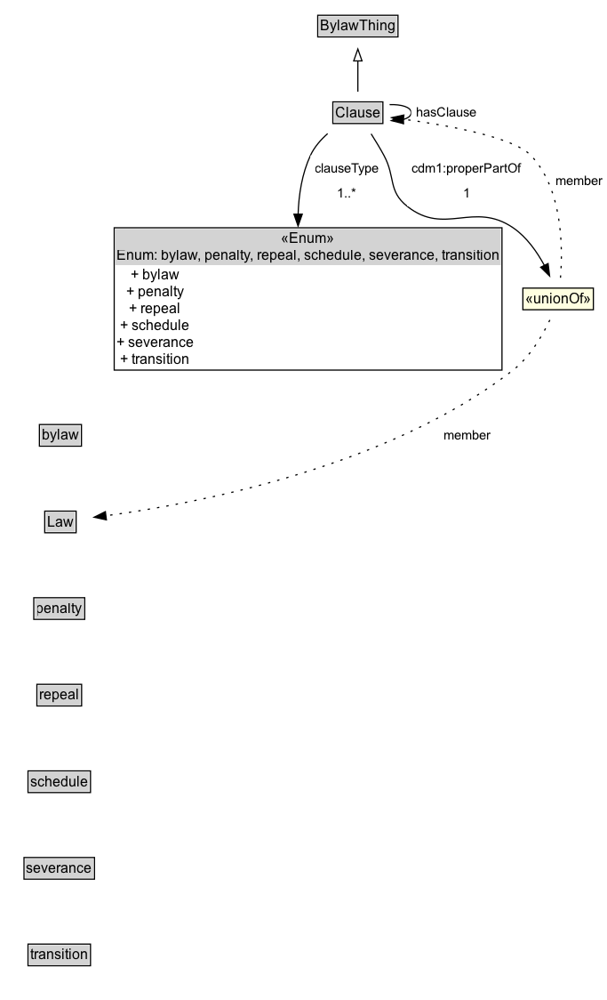

# Clause

A Clause is a statement of a rule, provision, requirement, etc. that is part of the body of the Law, or its schedules, penalties, etc.

## Diagram

=== "SVG (interactive)"

    <!-- Generated by graphviz version 14.1.3 (20260303.0454)
     -->
    <!-- Pages: 1 -->
    <svg width="512pt" height="843pt"
     viewBox="0.00 0.00 512.00 843.00" xmlns="http://www.w3.org/2000/svg" xmlns:xlink="http://www.w3.org/1999/xlink">
    <g id="graph0" class="graph" transform="scale(1 1) rotate(0) translate(4 839)">
    <polygon fill="white" stroke="none" points="-4,4 -4,-839 508.48,-839 508.48,4 -4,4"/>
    <g id="clust3" class="cluster">
    <title>cluster_associated</title>
    </g>
    <!-- BylawThing -->
    <g id="node1" class="node">
    <title>BylawThing</title>
    <g id="a_node1"><a xlink:href="../BylawThing" xlink:title="&lt;TABLE&gt;">
    <polygon fill="lightgray" stroke="none" points="265.12,-808.88 265.12,-825.12 330.88,-825.12 330.88,-808.88 265.12,-808.88"/>
    <text xml:space="preserve" text-anchor="start" x="266.12" y="-812.88" font-family="Arial" font-size="12.00">BylawThing</text>
    <polygon fill="none" stroke="black" points="264.12,-807.88 264.12,-826.12 331.88,-826.12 331.88,-807.88 264.12,-807.88"/>
    </a>
    </g>
    </g>
    <!-- Clause -->
    <g id="node2" class="node">
    <title>Clause</title>
    <g id="a_node2"><a xlink:href="../Clause" xlink:title="&lt;TABLE&gt;">
    <polygon fill="lightgray" stroke="none" points="277.88,-735.88 277.88,-752.12 318.12,-752.12 318.12,-735.88 277.88,-735.88"/>
    <text xml:space="preserve" text-anchor="start" x="278.88" y="-739.88" font-family="Arial" font-size="12.00">Clause</text>
    <polygon fill="none" stroke="black" points="276.88,-734.88 276.88,-753.12 319.12,-753.12 319.12,-734.88 276.88,-734.88"/>
    </a>
    </g>
    </g>
    <!-- Clause&#45;&gt;BylawThing -->
    <g id="edge1" class="edge">
    <title>Clause&#45;&gt;BylawThing</title>
    <path fill="none" stroke="black" d="M298,-761.71C298,-769.47 298,-778.92 298,-787.74"/>
    <polygon fill="none" stroke="black" points="294.5,-787.66 298,-797.66 301.5,-787.66 294.5,-787.66"/>
    </g>
    <!-- Clause&#45;&gt;Clause -->
    <g id="edge10" class="edge">
    <title>Clause&#45;&gt;Clause</title>
    <path fill="none" stroke="black" d="M324.79,-750.83C334.78,-751.05 343,-748.78 343,-744 343,-741.24 340.25,-739.31 336.01,-738.22"/>
    <polygon fill="black" stroke="black" points="336.58,-734.76 326.3,-737.31 335.93,-741.73 336.58,-734.76"/>
    <polygon fill="white" stroke="none" points="343,-733.25 343,-754.75 402,-754.75 402,-733.25 343,-733.25"/>
    <text xml:space="preserve" text-anchor="start" x="347" y="-740.25" font-family="Arial" font-size="11.00">hasClause</text>
    </g>
    <!-- Invis -->
    <!-- Clause&#45;&gt;Invis -->
    <!-- n7e2422bf65d74402b04f4f26665f0ae6b23 -->
    <g id="node11" class="node">
    <title>n7e2422bf65d74402b04f4f26665f0ae6b23</title>
    <polygon fill="lightgray" stroke="none" points="93.38,-615.5 93.38,-646 418.62,-646 418.62,-615.5 93.38,-615.5"/>
    <text xml:space="preserve" text-anchor="start" x="233.5" y="-633.75" font-family="Arial" font-size="12.00">«Enum»</text>
    <text xml:space="preserve" text-anchor="start" x="94.38" y="-619.5" font-family="Arial" font-size="12.00">Enum: bylaw, penalty, repeal, schedule, severance, transition</text>
    <text xml:space="preserve" text-anchor="start" x="106.38" y="-603.25" font-family="Arial" font-size="12.00">+ bylaw</text>
    <text xml:space="preserve" text-anchor="start" x="102.62" y="-589" font-family="Arial" font-size="12.00">+ penalty</text>
    <text xml:space="preserve" text-anchor="start" x="105.25" y="-574.75" font-family="Arial" font-size="12.00">+ repeal</text>
    <text xml:space="preserve" text-anchor="start" x="97.75" y="-560.5" font-family="Arial" font-size="12.00">+ schedule</text>
    <text xml:space="preserve" text-anchor="start" x="94.38" y="-546.25" font-family="Arial" font-size="12.00">+ severance</text>
    <text xml:space="preserve" text-anchor="start" x="97.75" y="-532" font-family="Arial" font-size="12.00">+ transition</text>
    <polygon fill="none" stroke="black" points="92.38,-527 92.38,-647 419.62,-647 419.62,-527 92.38,-527"/>
    </g>
    <!-- Clause&#45;&gt;n7e2422bf65d74402b04f4f26665f0ae6b23 -->
    <g id="edge11" class="edge">
    <title>Clause&#45;&gt;n7e2422bf65d74402b04f4f26665f0ae6b23</title>
    <path fill="none" stroke="black" d="M272.51,-726.35C266.69,-721.22 261.26,-715.03 258,-708 250.88,-692.65 248.08,-674.96 247.57,-657.97"/>
    <polygon fill="black" stroke="black" points="251.07,-658.43 247.54,-648.44 244.07,-658.45 251.07,-658.43"/>
    <polygon fill="white" stroke="none" points="258,-665 258,-708 320,-708 320,-665 258,-665"/>
    <text xml:space="preserve" text-anchor="start" x="262" y="-693.5" font-family="Arial" font-size="11.00">clauseType</text>
    <text xml:space="preserve" text-anchor="start" x="280.75" y="-672" font-family="Arial" font-size="11.00">1..&#42;</text>
    </g>
    <!-- n7e2422bf65d74402b04f4f26665f0ae6b31 -->
    <g id="node12" class="node">
    <title>n7e2422bf65d74402b04f4f26665f0ae6b31</title>
    <polygon fill="lightyellow" stroke="none" points="437.25,-577.88 437.25,-596.12 496.75,-596.12 496.75,-577.88 437.25,-577.88"/>
    <text xml:space="preserve" text-anchor="start" x="439.25" y="-582.88" font-family="Arial" font-size="12.00">«unionOf»</text>
    <polygon fill="none" stroke="black" points="437.25,-577.88 437.25,-596.12 496.75,-596.12 496.75,-577.88 437.25,-577.88"/>
    </g>
    <!-- Clause&#45;&gt;n7e2422bf65d74402b04f4f26665f0ae6b31 -->
    <g id="edge14" class="edge">
    <title>Clause&#45;&gt;n7e2422bf65d74402b04f4f26665f0ae6b31</title>
    <path fill="none" stroke="black" d="M309.2,-726.18C312.81,-720.5 316.72,-714.06 320,-708 330.01,-689.5 323.26,-678.05 339.75,-665 371.48,-639.88 395.58,-669.81 429,-647 440.48,-639.17 449.28,-626.6 455.5,-615.07"/>
    <polygon fill="black" stroke="black" points="458.54,-616.82 459.82,-606.3 452.26,-613.72 458.54,-616.82"/>
    <polygon fill="white" stroke="none" points="339.75,-665 339.75,-708 440,-708 440,-665 339.75,-665"/>
    <text xml:space="preserve" text-anchor="start" x="343.75" y="-693.5" font-family="Arial" font-size="11.00">cdm1:properPartOf</text>
    <text xml:space="preserve" text-anchor="start" x="386.88" y="-672" font-family="Arial" font-size="11.00">1</text>
    </g>
    <!-- bylaw -->
    <g id="node4" class="node">
    <title>bylaw</title>
    <g id="a_node4"><a xlink:href="../bylaw" xlink:title="&lt;TABLE&gt;">
    <polygon fill="lightgray" stroke="none" points="30.25,-463.88 30.25,-480.12 63.75,-480.12 63.75,-463.88 30.25,-463.88"/>
    <text xml:space="preserve" text-anchor="start" x="31.25" y="-467.88" font-family="Arial" font-size="12.00">bylaw</text>
    <polygon fill="none" stroke="black" points="29.25,-462.88 29.25,-481.12 64.75,-481.12 64.75,-462.88 29.25,-462.88"/>
    </a>
    </g>
    </g>
    <!-- Invis&#45;&gt;bylaw -->
    <!-- Law -->
    <g id="node5" class="node">
    <title>Law</title>
    <g id="a_node5"><a xlink:href="../Law" xlink:title="&lt;TABLE&gt;">
    <polygon fill="lightgray" stroke="none" points="34.75,-390.88 34.75,-407.12 59.25,-407.12 59.25,-390.88 34.75,-390.88"/>
    <text xml:space="preserve" text-anchor="start" x="35.75" y="-394.88" font-family="Arial" font-size="12.00">Law</text>
    <polygon fill="none" stroke="black" points="33.75,-389.88 33.75,-408.12 60.25,-408.12 60.25,-389.88 33.75,-389.88"/>
    </a>
    </g>
    </g>
    <!-- bylaw&#45;&gt;Law -->
    <!-- penalty -->
    <g id="node6" class="node">
    <title>penalty</title>
    <g id="a_node6"><a xlink:href="../penalty" xlink:title="&lt;TABLE&gt;">
    <polygon fill="lightgray" stroke="none" points="25.5,-317.88 25.5,-334.12 66.5,-334.12 66.5,-317.88 25.5,-317.88"/>
    <text xml:space="preserve" text-anchor="start" x="26.5" y="-321.88" font-family="Arial" font-size="12.00">penalty</text>
    <polygon fill="none" stroke="black" points="24.5,-316.88 24.5,-335.12 67.5,-335.12 67.5,-316.88 24.5,-316.88"/>
    </a>
    </g>
    </g>
    <!-- Law&#45;&gt;penalty -->
    <!-- repeal -->
    <g id="node7" class="node">
    <title>repeal</title>
    <g id="a_node7"><a xlink:href="../repeal" xlink:title="&lt;TABLE&gt;">
    <polygon fill="lightgray" stroke="none" points="28.12,-244.88 28.12,-261.12 63.88,-261.12 63.88,-244.88 28.12,-244.88"/>
    <text xml:space="preserve" text-anchor="start" x="29.12" y="-248.88" font-family="Arial" font-size="12.00">repeal</text>
    <polygon fill="none" stroke="black" points="27.12,-243.88 27.12,-262.12 64.88,-262.12 64.88,-243.88 27.12,-243.88"/>
    </a>
    </g>
    </g>
    <!-- penalty&#45;&gt;repeal -->
    <!-- schedule -->
    <g id="node8" class="node">
    <title>schedule</title>
    <g id="a_node8"><a xlink:href="../schedule" xlink:title="&lt;TABLE&gt;">
    <polygon fill="lightgray" stroke="none" points="20.62,-171.88 20.62,-188.12 71.38,-188.12 71.38,-171.88 20.62,-171.88"/>
    <text xml:space="preserve" text-anchor="start" x="21.62" y="-175.88" font-family="Arial" font-size="12.00">schedule</text>
    <polygon fill="none" stroke="black" points="19.62,-170.88 19.62,-189.12 72.38,-189.12 72.38,-170.88 19.62,-170.88"/>
    </a>
    </g>
    </g>
    <!-- repeal&#45;&gt;schedule -->
    <!-- severance -->
    <g id="node9" class="node">
    <title>severance</title>
    <g id="a_node9"><a xlink:href="../severance" xlink:title="&lt;TABLE&gt;">
    <polygon fill="lightgray" stroke="none" points="17.25,-98.88 17.25,-115.12 74.75,-115.12 74.75,-98.88 17.25,-98.88"/>
    <text xml:space="preserve" text-anchor="start" x="18.25" y="-102.88" font-family="Arial" font-size="12.00">severance</text>
    <polygon fill="none" stroke="black" points="16.25,-97.88 16.25,-116.12 75.75,-116.12 75.75,-97.88 16.25,-97.88"/>
    </a>
    </g>
    </g>
    <!-- schedule&#45;&gt;severance -->
    <!-- transition -->
    <g id="node10" class="node">
    <title>transition</title>
    <g id="a_node10"><a xlink:href="../transition" xlink:title="&lt;TABLE&gt;">
    <polygon fill="lightgray" stroke="none" points="20.62,-25.88 20.62,-42.12 71.38,-42.12 71.38,-25.88 20.62,-25.88"/>
    <text xml:space="preserve" text-anchor="start" x="21.62" y="-29.88" font-family="Arial" font-size="12.00">transition</text>
    <polygon fill="none" stroke="black" points="19.62,-24.88 19.62,-43.12 72.38,-43.12 72.38,-24.88 19.62,-24.88"/>
    </a>
    </g>
    </g>
    <!-- severance&#45;&gt;transition -->
    <!-- n7e2422bf65d74402b04f4f26665f0ae6b31&#45;&gt;Clause -->
    <g id="edge12" class="edge">
    <title>n7e2422bf65d74402b04f4f26665f0ae6b31&#45;&gt;Clause</title>
    <path fill="none" stroke="black" stroke-dasharray="1,5" d="M469,-604.86C471.04,-630.67 470.81,-679.93 444,-708 429.36,-723.33 374.37,-733.31 336.23,-738.55"/>
    <polygon fill="black" stroke="black" points="335.95,-735.06 326.49,-739.83 336.86,-742 335.95,-735.06"/>
    <text xml:space="preserve" text-anchor="middle" x="484.61" y="-682.8" font-family="Arial" font-size="11.00">member</text>
    </g>
    <!-- n7e2422bf65d74402b04f4f26665f0ae6b31&#45;&gt;Law -->
    <g id="edge13" class="edge">
    <title>n7e2422bf65d74402b04f4f26665f0ae6b31&#45;&gt;Law</title>
    <path fill="none" stroke="black" stroke-dasharray="1,5" d="M460.02,-569.26C453.72,-556.05 443.25,-538.05 429,-527 322.07,-444.05 158.34,-413.92 84.92,-404.17"/>
    <polygon fill="black" stroke="black" points="85.8,-400.75 75.44,-402.96 84.92,-407.7 85.8,-400.75"/>
    <text xml:space="preserve" text-anchor="middle" x="390.53" y="-468.3" font-family="Arial" font-size="11.00">member</text>
    </g>
    </g>
    </svg>

=== "PNG"

    

## Formalization for Clause

| Property | Constraint |
|----------|------------|
| [cdm1:hasDescription](https://w3id.org/citydata/part1/v1/hasDescription) | max 1 |
| [cdm1:hasDescription](https://w3id.org/citydata/part1/v1/hasDescription) | max 1 xsd:string |
| [cdm1:hasIdentifier](https://w3id.org/citydata/part1/v1/hasIdentifier) | max 1 |
| [cdm1:hasIdentifier](https://w3id.org/citydata/part1/v1/hasIdentifier) | max 1 xsd:string |
| [cdm1:hasName](https://w3id.org/citydata/part1/v1/hasName) | max 1 |
| [cdm1:hasName](https://w3id.org/citydata/part1/v1/hasName) | max 1 xsd:string |
| [cdm1:properPartOf](https://w3id.org/citydata/part1/v1/properPartOf) | exactly 1 |
| [clauseType](../properties/clauseType.md) | min 1 |
| [hasClause](../properties/hasClause.md) | only [Clause](https://w3id.org/citydata/part2/v1/Clause) |
| subClassOf | [BylawThing](BylawThing.md) |

