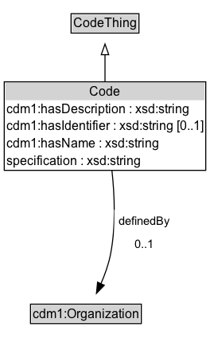

# Code

A code represents a possible set of values for a property, according to some predefined system of values.

## Diagram

=== "SVG (interactive)"

    <!-- Generated by graphviz version 14.1.3 (20260303.0454)
     -->
    <!-- Pages: 1 -->
    <svg width="198pt" height="333pt"
     viewBox="0.00 0.00 198.00 333.00" xmlns="http://www.w3.org/2000/svg" xmlns:xlink="http://www.w3.org/1999/xlink">
    <g id="graph0" class="graph" transform="scale(1 1) rotate(0) translate(4 329.25)">
    <polygon fill="white" stroke="none" points="-4,4 -4,-329.25 194,-329.25 194,4 -4,4"/>
    <g id="clust3" class="cluster">
    <title>cluster_associated</title>
    </g>
    <!-- CodeThing -->
    <g id="node1" class="node">
    <title>CodeThing</title>
    <g id="a_node1"><a xlink:href="../CodeThing" xlink:title="&lt;TABLE&gt;">
    <polygon fill="lightgray" stroke="none" points="64,-299.12 64,-315.38 126,-315.38 126,-299.12 64,-299.12"/>
    <text xml:space="preserve" text-anchor="start" x="65" y="-303.12" font-family="Arial" font-size="12.00">CodeThing</text>
    <polygon fill="none" stroke="black" points="63,-298.12 63,-316.38 127,-316.38 127,-298.12 63,-298.12"/>
    </a>
    </g>
    </g>
    <!-- Code -->
    <g id="node2" class="node">
    <title>Code</title>
    <g id="a_node2"><a xlink:href="../Code" xlink:title="&lt;TABLE&gt;">
    <polygon fill="lightgray" stroke="none" points="1,-235 1,-251.25 189,-251.25 189,-235 1,-235"/>
    <text xml:space="preserve" text-anchor="start" x="80.38" y="-239" font-family="Arial" font-size="12.00">Code</text>
    <text xml:space="preserve" text-anchor="start" x="2" y="-222.75" font-family="Arial" font-size="12.00">cdm1:hasDescription : xsd:string</text>
    <text xml:space="preserve" text-anchor="start" x="2" y="-206.5" font-family="Arial" font-size="12.00">cdm1:hasIdentifier : xsd:string [0..1]</text>
    <text xml:space="preserve" text-anchor="start" x="2" y="-190.25" font-family="Arial" font-size="12.00">cdm1:hasName : xsd:string</text>
    <text xml:space="preserve" text-anchor="start" x="2" y="-174" font-family="Arial" font-size="12.00">specification : xsd:string</text>
    <polygon fill="none" stroke="black" points="0,-169 0,-252.25 190,-252.25 190,-169 0,-169"/>
    </a>
    </g>
    </g>
    <!-- Code&#45;&gt;CodeThing -->
    <g id="edge1" class="edge">
    <title>Code&#45;&gt;CodeThing</title>
    <path fill="none" stroke="black" d="M95,-251.98C95,-260.68 95,-269.7 95,-277.83"/>
    <polygon fill="none" stroke="black" points="91.5,-277.82 95,-287.82 98.5,-277.82 91.5,-277.82"/>
    </g>
    <!-- Invis -->
    <!-- Code&#45;&gt;Invis -->
    <!-- cdm1_Organization -->
    <g id="node4" class="node">
    <title>cdm1_Organization</title>
    <g id="a_node4"><a xlink:href="https://w3id.org/citydata/part1/v1/Organization" xlink:title="&lt;TABLE&gt;">
    <polygon fill="lightgray" stroke="none" points="25.75,-25.88 25.75,-42.12 128.25,-42.12 128.25,-25.88 25.75,-25.88"/>
    <text xml:space="preserve" text-anchor="start" x="26.75" y="-29.88" font-family="Arial" font-size="12.00">cdm1:Organization</text>
    <polygon fill="none" stroke="black" points="24.75,-24.88 24.75,-43.12 129.25,-43.12 129.25,-24.88 24.75,-24.88"/>
    </a>
    </g>
    </g>
    <!-- Code&#45;&gt;cdm1_Organization -->
    <g id="edge4" class="edge">
    <title>Code&#45;&gt;cdm1_Organization</title>
    <path fill="none" stroke="black" d="M101.52,-169.03C104.11,-145.44 105.36,-115.29 100,-89 98.16,-79.98 94.75,-70.59 91.11,-62.23"/>
    <polygon fill="black" stroke="black" points="94.35,-60.89 86.95,-53.31 88,-63.85 94.35,-60.89"/>
    <polygon fill="white" stroke="none" points="103.75,-89 103.75,-132 159.75,-132 159.75,-89 103.75,-89"/>
    <text xml:space="preserve" text-anchor="start" x="107.75" y="-117.5" font-family="Arial" font-size="11.00">definedBy</text>
    <text xml:space="preserve" text-anchor="start" x="122.75" y="-96" font-family="Arial" font-size="11.00">0..1</text>
    </g>
    <!-- Invis&#45;&gt;cdm1_Organization -->
    </g>
    </svg>

=== "PNG"

    

## Formalization for Code

| Property | Constraint |
|----------|------------|
| [cdm1:hasDescription](https://w3id.org/citydata/part1/v1/hasDescription) | datatype xsd:string |
| [cdm1:hasIdentifier](https://w3id.org/citydata/part1/v1/hasIdentifier) | max 1 |
| [cdm1:hasIdentifier](https://w3id.org/citydata/part1/v1/hasIdentifier) | max 1 xsd:string |
| [cdm1:hasName](https://w3id.org/citydata/part1/v1/hasName) | datatype xsd:string |
| [definedBy](../properties/definedBy.md) | max 1 |
| [definedBy](../properties/definedBy.md) | max 1 [cdm1:Organization](https://w3id.org/citydata/part1/v1/Organization) |
| [specification](../properties/specification.md) | datatype xsd:string |
| subClassOf | [CodeThing](CodeThing.md) |

