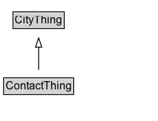

# ContactThing

Added for organizational purposes, to identify classes defined in the Contact ontology.

## Diagram

=== "SVG (interactive)"

    <!-- Generated by graphviz version 14.1.3 (20260303.0454)
     -->
    <!-- Pages: 1 -->
    <svg width="172pt" height="132pt"
     viewBox="0.00 0.00 172.00 132.00" xmlns="http://www.w3.org/2000/svg" xmlns:xlink="http://www.w3.org/1999/xlink">
    <g id="graph0" class="graph" transform="scale(1 1) rotate(0) translate(4 128)">
    <polygon fill="white" stroke="none" points="-4,4 -4,-128 168,-128 168,4 -4,4"/>
    <g id="clust3" class="cluster">
    <title>cluster_associated</title>
    </g>
    <!-- CityThing -->
    <g id="node1" class="node">
    <title>CityThing</title>
    <g id="a_node1"><a xlink:href="../CityThing" xlink:title="&lt;TABLE&gt;">
    <polygon fill="lightgray" stroke="none" points="11.12,-97.88 11.12,-114.12 64.88,-114.12 64.88,-97.88 11.12,-97.88"/>
    <text xml:space="preserve" text-anchor="start" x="12.12" y="-101.88" font-family="Arial" font-size="12.00">CityThing</text>
    <polygon fill="none" stroke="black" points="10.12,-96.88 10.12,-115.12 65.88,-115.12 65.88,-96.88 10.12,-96.88"/>
    </a>
    </g>
    </g>
    <!-- ContactThing -->
    <g id="node2" class="node">
    <title>ContactThing</title>
    <g id="a_node2"><a xlink:href="../ContactThing" xlink:title="&lt;TABLE&gt;">
    <polygon fill="lightgray" stroke="none" points="1,-25.88 1,-42.12 75,-42.12 75,-25.88 1,-25.88"/>
    <text xml:space="preserve" text-anchor="start" x="2" y="-29.88" font-family="Arial" font-size="12.00">ContactThing</text>
    <polygon fill="none" stroke="black" points="0,-24.88 0,-43.12 76,-43.12 76,-24.88 0,-24.88"/>
    </a>
    </g>
    </g>
    <!-- ContactThing&#45;&gt;CityThing -->
    <g id="edge1" class="edge">
    <title>ContactThing&#45;&gt;CityThing</title>
    <path fill="none" stroke="black" d="M38,-51.79C38,-59.25 38,-68.24 38,-76.69"/>
    <polygon fill="none" stroke="black" points="34.5,-76.54 38,-86.54 41.5,-76.54 34.5,-76.54"/>
    </g>
    <!-- Invis -->
    </g>
    </svg>

=== "PNG"

    

## Specializations of ContactThing

| Class | Description |
|-------|-------------|
| [Address](Address.md) | Address is the main concept for a contact.  It has been designed to represent any type of address in the world, including India and the UK.  For example, the property hasBuilding is important in many UK and Indian addresses to further identify the person or business location. Street information is divided into separate properties to fully identify direction (hasStreetDirection), Type (hasStreetType), etc. |
| [Address Type](AddressType.md) | Address Type is a type of Code that describes the type of address, such as residential, business, or mailing. |
| [Country](Country.md) | A Country is a specialization of a Jurisdictional Area that is formally identified as such. |
| [Phone Number](PhoneNumber.md) | A PhoneNumber defines the complete international phone number and type of number. |
| [Phone Type](PhoneType.md) | A PhoneType defines the type of phone number. |
| [State](State.md) | A State is a political subdivision of a country. |
| [Street Direction](StreetDirection.md) | A StreetDirection defines the directional component of a street name. |
| [Street Type](StreetType.md) | A StreetType defines the type of street. |

## Formalization for ContactThing

| Property | Constraint |
|----------|------------|
| subClassOf | [CityThing](CityThing.md) |

