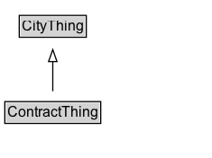

# ContractThing

Added for organizational purposes, to identify classes defined in the Contract ontology.

## Diagram

=== "SVG (interactive)"

    <!-- Generated by graphviz version 14.1.3 (20260303.0454)
     -->
    <!-- Pages: 1 -->
    <svg width="176pt" height="132pt"
     viewBox="0.00 0.00 176.00 132.00" xmlns="http://www.w3.org/2000/svg" xmlns:xlink="http://www.w3.org/1999/xlink">
    <g id="graph0" class="graph" transform="scale(1 1) rotate(0) translate(4 128)">
    <polygon fill="white" stroke="none" points="-4,4 -4,-128 171.88,-128 171.88,4 -4,4"/>
    <g id="clust3" class="cluster">
    <title>cluster_associated</title>
    </g>
    <!-- CityThing -->
    <g id="node1" class="node">
    <title>CityThing</title>
    <g id="a_node1"><a xlink:href="../CityThing" xlink:title="&lt;TABLE&gt;">
    <polygon fill="lightgray" stroke="none" points="13,-97.88 13,-114.12 66.75,-114.12 66.75,-97.88 13,-97.88"/>
    <text xml:space="preserve" text-anchor="start" x="14" y="-101.88" font-family="Arial" font-size="12.00">CityThing</text>
    <polygon fill="none" stroke="black" points="12,-96.88 12,-115.12 67.75,-115.12 67.75,-96.88 12,-96.88"/>
    </a>
    </g>
    </g>
    <!-- ContractThing -->
    <g id="node2" class="node">
    <title>ContractThing</title>
    <g id="a_node2"><a xlink:href="../ContractThing" xlink:title="&lt;TABLE&gt;">
    <polygon fill="lightgray" stroke="none" points="1,-25.88 1,-42.12 78.75,-42.12 78.75,-25.88 1,-25.88"/>
    <text xml:space="preserve" text-anchor="start" x="2" y="-29.88" font-family="Arial" font-size="12.00">ContractThing</text>
    <polygon fill="none" stroke="black" points="0,-24.88 0,-43.12 79.75,-43.12 79.75,-24.88 0,-24.88"/>
    </a>
    </g>
    </g>
    <!-- ContractThing&#45;&gt;CityThing -->
    <g id="edge1" class="edge">
    <title>ContractThing&#45;&gt;CityThing</title>
    <path fill="none" stroke="black" d="M39.88,-51.79C39.88,-59.25 39.88,-68.24 39.88,-76.69"/>
    <polygon fill="none" stroke="black" points="36.38,-76.54 39.88,-86.54 43.38,-76.54 36.38,-76.54"/>
    </g>
    <!-- Invis -->
    </g>
    </svg>

=== "PNG"

    

## Specializations of ContractThing

| Class | Description |
|-------|-------------|
| [Condition Precedent](ConditionPrecedent.md) | A condition precedent is a condition that must be met before a contract becomes effective. |
| [Contract](Contract.md) | A contract is a legally binding agreement between two or more parties. |
| [Contractual Commitment](ContractualCommitment.md) | A contractual commitment is a legally binding part of a contract that consists of a promise made by a party in relation to the contract. |
| [Contractual Definition](ContractualDefinition.md) | A contractual definition is a definition of a term used within a contract. |
| [Contractual Element](ContractualElement.md) | A contractual element is an element that forms part of a contract, such as a definition, condition, or commitment. |
| [Non Binding Term](NonBindingTerm.md) | A NonBindingTerm is a term in a contract that does not have legal force. |
| [Representation](Representation.md) | Part of the Contract that specifies some assertions that are taken to be true at the time of the contract and serve to influence a party's decision to enter into the Contract. |
| [Warranty](Warranty.md) | A Warranty is a contractual promise of some indemnification if an assertion made in the Contract is false. |

## Formalization for ContractThing

| Property | Constraint |
|----------|------------|
| subClassOf | [CityThing](CityThing.md) |

