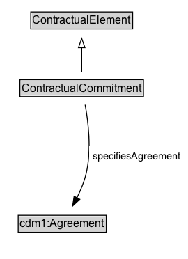

# ContractualCommitment

A contractual commitment is a legally binding part of a contract that consists of a promise made by a party in relation to the contract.

## Diagram

=== "SVG (interactive)"

    <!-- Generated by graphviz version 14.1.3 (20260303.0454)
     -->
    <!-- Pages: 1 -->
    <svg width="202pt" height="279pt"
     viewBox="0.00 0.00 202.00 279.00" xmlns="http://www.w3.org/2000/svg" xmlns:xlink="http://www.w3.org/1999/xlink">
    <g id="graph0" class="graph" transform="scale(1 1) rotate(0) translate(4 275)">
    <polygon fill="white" stroke="none" points="-4,4 -4,-275 198.48,-275 198.48,4 -4,4"/>
    <g id="clust3" class="cluster">
    <title>cluster_associated</title>
    </g>
    <!-- ContractualElement -->
    <g id="node1" class="node">
    <title>ContractualElement</title>
    <g id="a_node1"><a xlink:href="../ContractualElement" xlink:title="&lt;TABLE&gt;">
    <polygon fill="lightgray" stroke="none" points="30.12,-244.88 30.12,-261.12 137.88,-261.12 137.88,-244.88 30.12,-244.88"/>
    <text xml:space="preserve" text-anchor="start" x="31.12" y="-248.88" font-family="Arial" font-size="12.00">ContractualElement</text>
    <polygon fill="none" stroke="black" points="29.12,-243.88 29.12,-262.12 138.88,-262.12 138.88,-243.88 29.12,-243.88"/>
    </a>
    </g>
    </g>
    <!-- ContractualCommitment -->
    <g id="node2" class="node">
    <title>ContractualCommitment</title>
    <g id="a_node2"><a xlink:href="../ContractualCommitment" xlink:title="&lt;TABLE&gt;">
    <polygon fill="lightgray" stroke="none" points="18.5,-171.88 18.5,-188.12 149.5,-188.12 149.5,-171.88 18.5,-171.88"/>
    <text xml:space="preserve" text-anchor="start" x="19.5" y="-175.88" font-family="Arial" font-size="12.00">ContractualCommitment</text>
    <polygon fill="none" stroke="black" points="17.5,-170.88 17.5,-189.12 150.5,-189.12 150.5,-170.88 17.5,-170.88"/>
    </a>
    </g>
    </g>
    <!-- ContractualCommitment&#45;&gt;ContractualElement -->
    <g id="edge1" class="edge">
    <title>ContractualCommitment&#45;&gt;ContractualElement</title>
    <path fill="none" stroke="black" d="M84,-197.71C84,-205.47 84,-214.92 84,-223.74"/>
    <polygon fill="none" stroke="black" points="80.5,-223.66 84,-233.66 87.5,-223.66 80.5,-223.66"/>
    </g>
    <!-- Invis -->
    <!-- ContractualCommitment&#45;&gt;Invis -->
    <!-- cdm1_Agreement -->
    <g id="node4" class="node">
    <title>cdm1_Agreement</title>
    <g id="a_node4"><a xlink:href="https://w3id.org/citydata/part1/v1/Agreement" xlink:title="&lt;TABLE&gt;">
    <polygon fill="lightgray" stroke="none" points="16.62,-25.88 16.62,-42.12 109.38,-42.12 109.38,-25.88 16.62,-25.88"/>
    <text xml:space="preserve" text-anchor="start" x="17.62" y="-29.88" font-family="Arial" font-size="12.00">cdm1:Agreement</text>
    <polygon fill="none" stroke="black" points="15.62,-24.88 15.62,-43.12 110.38,-43.12 110.38,-24.88 15.62,-24.88"/>
    </a>
    </g>
    </g>
    <!-- ContractualCommitment&#45;&gt;cdm1_Agreement -->
    <g id="edge4" class="edge">
    <title>ContractualCommitment&#45;&gt;cdm1_Agreement</title>
    <path fill="none" stroke="black" d="M87.69,-162.18C91.05,-143.92 94.71,-114.02 89,-89 86.88,-79.73 82.96,-70.19 78.8,-61.76"/>
    <polygon fill="black" stroke="black" points="81.99,-60.32 74.22,-53.12 75.81,-63.6 81.99,-60.32"/>
    <polygon fill="white" stroke="none" points="91.98,-96.25 91.98,-117.75 194.48,-117.75 194.48,-96.25 91.98,-96.25"/>
    <text xml:space="preserve" text-anchor="start" x="95.98" y="-103.25" font-family="Arial" font-size="11.00">specifiesAgreement</text>
    </g>
    <!-- Invis&#45;&gt;cdm1_Agreement -->
    </g>
    </svg>

=== "PNG"

    

## Formalization for ContractualCommitment

| Property | Constraint |
|----------|------------|
| [specifiesAgreement](../properties/specifiesAgreement.md) | only [cdm1:Agreement](https://w3id.org/citydata/part1/v1/Agreement) |
| subClassOf | [ContractualElement](ContractualElement.md) |

