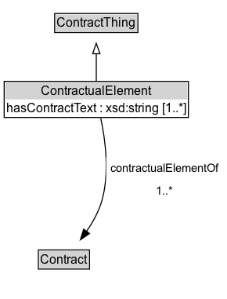

# ContractualElement

A contractual element is an element that forms part of a contract, such as a definition, condition, or commitment.

## Diagram

=== "SVG (interactive)"

    <!-- Generated by graphviz version 14.1.3 (20260303.0454)
     -->
    <!-- Pages: 1 -->
    <svg width="217pt" height="286pt"
     viewBox="0.00 0.00 217.00 286.00" xmlns="http://www.w3.org/2000/svg" xmlns:xlink="http://www.w3.org/1999/xlink">
    <g id="graph0" class="graph" transform="scale(1 1) rotate(0) translate(4 282)">
    <polygon fill="white" stroke="none" points="-4,4 -4,-282 213.25,-282 213.25,4 -4,4"/>
    <g id="clust3" class="cluster">
    <title>cluster_associated</title>
    </g>
    <!-- ContractThing -->
    <g id="node1" class="node">
    <title>ContractThing</title>
    <g id="a_node1"><a xlink:href="../ContractThing" xlink:title="&lt;TABLE&gt;">
    <polygon fill="lightgray" stroke="none" points="49.38,-251.88 49.38,-268.12 127.12,-268.12 127.12,-251.88 49.38,-251.88"/>
    <text xml:space="preserve" text-anchor="start" x="50.38" y="-255.88" font-family="Arial" font-size="12.00">ContractThing</text>
    <polygon fill="none" stroke="black" points="48.38,-250.88 48.38,-269.12 128.12,-269.12 128.12,-250.88 48.38,-250.88"/>
    </a>
    </g>
    </g>
    <!-- ContractualElement -->
    <g id="node2" class="node">
    <title>ContractualElement</title>
    <g id="a_node2"><a xlink:href="../ContractualElement" xlink:title="&lt;TABLE&gt;">
    <polygon fill="lightgray" stroke="none" points="1,-187 1,-203.25 175.5,-203.25 175.5,-187 1,-187"/>
    <text xml:space="preserve" text-anchor="start" x="35.38" y="-191" font-family="Arial" font-size="12.00">ContractualElement</text>
    <text xml:space="preserve" text-anchor="start" x="2" y="-174.75" font-family="Arial" font-size="12.00">hasContractText : xsd:string [1..&#42;]</text>
    <polygon fill="none" stroke="black" points="0,-169.75 0,-204.25 176.5,-204.25 176.5,-169.75 0,-169.75"/>
    </a>
    </g>
    </g>
    <!-- ContractualElement&#45;&gt;ContractThing -->
    <g id="edge1" class="edge">
    <title>ContractualElement&#45;&gt;ContractThing</title>
    <path fill="none" stroke="black" d="M88.25,-204.71C88.25,-212.47 88.25,-221.92 88.25,-230.74"/>
    <polygon fill="none" stroke="black" points="84.75,-230.66 88.25,-240.66 91.75,-230.66 84.75,-230.66"/>
    </g>
    <!-- Invis -->
    <!-- ContractualElement&#45;&gt;Invis -->
    <!-- Contract -->
    <g id="node4" class="node">
    <title>Contract</title>
    <g id="a_node4"><a xlink:href="../Contract" xlink:title="&lt;TABLE&gt;">
    <polygon fill="lightgray" stroke="none" points="33.75,-25.88 33.75,-42.12 80.75,-42.12 80.75,-25.88 33.75,-25.88"/>
    <text xml:space="preserve" text-anchor="start" x="34.75" y="-29.88" font-family="Arial" font-size="12.00">Contract</text>
    <polygon fill="none" stroke="black" points="32.75,-24.88 32.75,-43.12 81.75,-43.12 81.75,-24.88 32.75,-24.88"/>
    </a>
    </g>
    </g>
    <!-- ContractualElement&#45;&gt;Contract -->
    <g id="edge4" class="edge">
    <title>ContractualElement&#45;&gt;Contract</title>
    <path fill="none" stroke="black" d="M92.53,-169.11C96.74,-149.42 101.46,-116.11 93.25,-89 90.25,-79.08 84.75,-69.31 78.95,-60.88"/>
    <polygon fill="black" stroke="black" points="81.78,-58.82 73.02,-52.86 76.15,-62.98 81.78,-58.82"/>
    <polygon fill="white" stroke="none" points="97.75,-89 97.75,-132 209.25,-132 209.25,-89 97.75,-89"/>
    <text xml:space="preserve" text-anchor="start" x="101.75" y="-117.5" font-family="Arial" font-size="11.00">contractualElementOf</text>
    <text xml:space="preserve" text-anchor="start" x="145.25" y="-96" font-family="Arial" font-size="11.00">1..&#42;</text>
    </g>
    <!-- Invis&#45;&gt;Contract -->
    </g>
    </svg>

=== "PNG"

    

## Specializations of ContractualElement

| Class | Description |
|-------|-------------|
| [Condition Precedent](ConditionPrecedent.md) | A condition precedent is a condition that must be met before a contract becomes effective. |
| [Contractual Commitment](ContractualCommitment.md) | A contractual commitment is a legally binding part of a contract that consists of a promise made by a party in relation to the contract. |
| [Contractual Definition](ContractualDefinition.md) | A contractual definition is a definition of a term used within a contract. |
| [Non Binding Term](NonBindingTerm.md) | A NonBindingTerm is a term in a contract that does not have legal force. |
| [Representation](Representation.md) | Part of the Contract that specifies some assertions that are taken to be true at the time of the contract and serve to influence a party's decision to enter into the Contract. |
| [Warranty](Warranty.md) | A Warranty is a contractual promise of some indemnification if an assertion made in the Contract is false. |

## Formalization for ContractualElement

| Property | Constraint |
|----------|------------|
| [contractualElementOf](../properties/contractualElementOf.md) | min 1 |
| [contractualElementOf](../properties/contractualElementOf.md) | min 1 [Contract](https://w3id.org/citydata/part2/v1/Contract) |
| [hasContractText](../properties/hasContractText.md) | min 1 |
| [hasContractText](../properties/hasContractText.md) | min 1 xsd:string |
| subClassOf | [ContractThing](ContractThing.md) |

