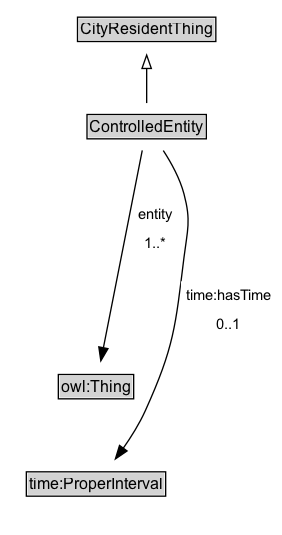

# ControlledEntity

A controlled entity is an entity that is subject to control by another entity.

## Diagram

=== "SVG (interactive)"

    <!-- Generated by graphviz version 14.1.3 (20260303.0454)
     -->
    <!-- Pages: 1 -->
    <svg width="211pt" height="401pt"
     viewBox="0.00 0.00 211.00 401.00" xmlns="http://www.w3.org/2000/svg" xmlns:xlink="http://www.w3.org/1999/xlink">
    <g id="graph0" class="graph" transform="scale(1 1) rotate(0) translate(4 397)">
    <polygon fill="white" stroke="none" points="-4,4 -4,-397 207.43,-397 207.43,4 -4,4"/>
    <g id="clust3" class="cluster">
    <title>cluster_associated</title>
    </g>
    <!-- CityResidentThing -->
    <g id="node1" class="node">
    <title>CityResidentThing</title>
    <g id="a_node1"><a xlink:href="../CityResidentThing" xlink:title="&lt;TABLE&gt;">
    <polygon fill="lightgray" stroke="none" points="55.12,-366.88 55.12,-383.12 156.88,-383.12 156.88,-366.88 55.12,-366.88"/>
    <text xml:space="preserve" text-anchor="start" x="56.12" y="-370.88" font-family="Arial" font-size="12.00">CityResidentThing</text>
    <polygon fill="none" stroke="black" points="54.12,-365.88 54.12,-384.12 157.88,-384.12 157.88,-365.88 54.12,-365.88"/>
    </a>
    </g>
    </g>
    <!-- ControlledEntity -->
    <g id="node2" class="node">
    <title>ControlledEntity</title>
    <g id="a_node2"><a xlink:href="../ControlledEntity" xlink:title="&lt;TABLE&gt;">
    <polygon fill="lightgray" stroke="none" points="62.25,-293.88 62.25,-310.12 149.75,-310.12 149.75,-293.88 62.25,-293.88"/>
    <text xml:space="preserve" text-anchor="start" x="63.25" y="-297.88" font-family="Arial" font-size="12.00">ControlledEntity</text>
    <polygon fill="none" stroke="black" points="61.25,-292.88 61.25,-311.12 150.75,-311.12 150.75,-292.88 61.25,-292.88"/>
    </a>
    </g>
    </g>
    <!-- ControlledEntity&#45;&gt;CityResidentThing -->
    <g id="edge1" class="edge">
    <title>ControlledEntity&#45;&gt;CityResidentThing</title>
    <path fill="none" stroke="black" d="M106,-319.71C106,-327.47 106,-336.92 106,-345.74"/>
    <polygon fill="none" stroke="black" points="102.5,-345.66 106,-355.66 109.5,-345.66 102.5,-345.66"/>
    </g>
    <!-- Invis -->
    <!-- ControlledEntity&#45;&gt;Invis -->
    <!-- owl_Thing -->
    <g id="node4" class="node">
    <title>owl_Thing</title>
    <g id="a_node4"><a xlink:href="https://w3id.org/citydata/imported/owl/latest/Thing" xlink:title="&lt;TABLE&gt;">
    <polygon fill="lightgray" stroke="none" points="40.75,-98.88 40.75,-115.12 95.25,-115.12 95.25,-98.88 40.75,-98.88"/>
    <text xml:space="preserve" text-anchor="start" x="41.75" y="-102.88" font-family="Arial" font-size="12.00">owl:Thing</text>
    <polygon fill="none" stroke="black" points="39.75,-97.88 39.75,-116.12 96.25,-116.12 96.25,-97.88 39.75,-97.88"/>
    </a>
    </g>
    </g>
    <!-- ControlledEntity&#45;&gt;owl_Thing -->
    <g id="edge5" class="edge">
    <title>ControlledEntity&#45;&gt;owl_Thing</title>
    <path fill="none" stroke="black" d="M102.69,-284.21C96.17,-251.06 81.56,-176.89 73.54,-136.14"/>
    <polygon fill="black" stroke="black" points="76.98,-135.51 71.62,-126.37 70.12,-136.86 76.98,-135.51"/>
    <polygon fill="white" stroke="none" points="96.15,-204 96.15,-247 129.65,-247 129.65,-204 96.15,-204"/>
    <text xml:space="preserve" text-anchor="start" x="100.15" y="-232.5" font-family="Arial" font-size="11.00">entity</text>
    <text xml:space="preserve" text-anchor="start" x="104.65" y="-211" font-family="Arial" font-size="11.00">1..&#42;</text>
    </g>
    <!-- time_ProperInterval -->
    <g id="node5" class="node">
    <title>time_ProperInterval</title>
    <g id="a_node5"><a xlink:href="https://w3id.org/citydata/imported/time/latest/ProperInterval" xlink:title="&lt;TABLE&gt;">
    <polygon fill="lightgray" stroke="none" points="16.75,-25.88 16.75,-42.12 119.25,-42.12 119.25,-25.88 16.75,-25.88"/>
    <text xml:space="preserve" text-anchor="start" x="17.75" y="-29.88" font-family="Arial" font-size="12.00">time:ProperInterval</text>
    <polygon fill="none" stroke="black" points="15.75,-24.88 15.75,-43.12 120.25,-43.12 120.25,-24.88 15.75,-24.88"/>
    </a>
    </g>
    </g>
    <!-- ControlledEntity&#45;&gt;time_ProperInterval -->
    <g id="edge6" class="edge">
    <title>ControlledEntity&#45;&gt;time_ProperInterval</title>
    <path fill="none" stroke="black" d="M118.46,-284.09C124.43,-274.94 130.93,-263.15 134,-251.5 139.37,-231.08 136.6,-224.95 134,-204 127.51,-151.69 126.68,-137.05 105,-89 100.59,-79.22 94.39,-69.3 88.33,-60.68"/>
    <polygon fill="black" stroke="black" points="91.29,-58.79 82.55,-52.8 85.64,-62.93 91.29,-58.79"/>
    <polygon fill="white" stroke="none" points="131.68,-143 131.68,-186 203.43,-186 203.43,-143 131.68,-143"/>
    <text xml:space="preserve" text-anchor="start" x="135.68" y="-171.5" font-family="Arial" font-size="11.00">time:hasTime</text>
    <text xml:space="preserve" text-anchor="start" x="158.56" y="-150" font-family="Arial" font-size="11.00">0..1</text>
    </g>
    <!-- Invis&#45;&gt;owl_Thing -->
    <!-- owl_Thing&#45;&gt;time_ProperInterval -->
    </g>
    </svg>

=== "PNG"

    

## Specializations of ControlledEntity

| Class | Description |
|-------|-------------|
| [Entity Operation](EntityOperation.md) | Activity of operating an Organization by City Resident. |
| [Entity Ownership](EntityOwnership.md) | Activity of owning a Building, Land Area, or Organization by City Resident. |

## Formalization for ControlledEntity

| Property | Constraint |
|----------|------------|
| [entity](../properties/entity.md) | min 1 |
| [entity](../properties/entity.md) | min 1 [owl:Thing](http://www.w3.org/2002/07/owl#Thing) |
| [time:hasTime](https://w3id.org/citydata/imported/time/hasTime) | max 1 |
| [time:hasTime](https://w3id.org/citydata/imported/time/hasTime) | max 1 [time:ProperInterval](http://www.w3.org/2006/time#ProperInterval) |
| subClassOf | [CityResidentThing](CityResidentThing.md) |

