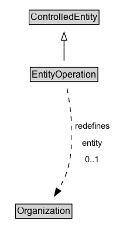

# EntityOperation

Activity of operating an Organization by City Resident.

## Diagram

=== "SVG (interactive)"

    <!-- Generated by graphviz version 14.1.3 (20260303.0454)
     -->
    <!-- Pages: 1 -->
    <svg width="148pt" height="308pt"
     viewBox="0.00 0.00 148.00 308.00" xmlns="http://www.w3.org/2000/svg" xmlns:xlink="http://www.w3.org/1999/xlink">
    <g id="graph0" class="graph" transform="scale(1 1) rotate(0) translate(4 303.5)">
    <polygon fill="white" stroke="none" points="-4,4 -4,-303.5 144.22,-303.5 144.22,4 -4,4"/>
    <g id="clust3" class="cluster">
    <title>cluster_associated</title>
    </g>
    <!-- ControlledEntity -->
    <g id="node1" class="node">
    <title>ControlledEntity</title>
    <g id="a_node1"><a xlink:href="../ControlledEntity" xlink:title="&lt;TABLE&gt;">
    <polygon fill="lightgray" stroke="none" points="34.25,-273.38 34.25,-289.62 121.75,-289.62 121.75,-273.38 34.25,-273.38"/>
    <text xml:space="preserve" text-anchor="start" x="35.25" y="-277.38" font-family="Arial" font-size="12.00">ControlledEntity</text>
    <polygon fill="none" stroke="black" points="33.25,-272.38 33.25,-290.62 122.75,-290.62 122.75,-272.38 33.25,-272.38"/>
    </a>
    </g>
    </g>
    <!-- EntityOperation -->
    <g id="node2" class="node">
    <title>EntityOperation</title>
    <g id="a_node2"><a xlink:href="../EntityOperation" xlink:title="&lt;TABLE&gt;">
    <polygon fill="lightgray" stroke="none" points="35.75,-200.38 35.75,-216.62 120.25,-216.62 120.25,-200.38 35.75,-200.38"/>
    <text xml:space="preserve" text-anchor="start" x="36.75" y="-204.38" font-family="Arial" font-size="12.00">EntityOperation</text>
    <polygon fill="none" stroke="black" points="34.75,-199.38 34.75,-217.62 121.25,-217.62 121.25,-199.38 34.75,-199.38"/>
    </a>
    </g>
    </g>
    <!-- EntityOperation&#45;&gt;ControlledEntity -->
    <g id="edge1" class="edge">
    <title>EntityOperation&#45;&gt;ControlledEntity</title>
    <path fill="none" stroke="black" d="M78,-226.21C78,-233.97 78,-243.42 78,-252.24"/>
    <polygon fill="none" stroke="black" points="74.5,-252.16 78,-262.16 81.5,-252.16 74.5,-252.16"/>
    </g>
    <!-- Invis -->
    <!-- EntityOperation&#45;&gt;Invis -->
    <!-- Organization -->
    <g id="node4" class="node">
    <title>Organization</title>
    <g id="a_node4"><a xlink:href="../Organization" xlink:title="&lt;TABLE&gt;">
    <polygon fill="lightgray" stroke="none" points="16.88,-25.88 16.88,-42.12 87.12,-42.12 87.12,-25.88 16.88,-25.88"/>
    <text xml:space="preserve" text-anchor="start" x="17.88" y="-29.88" font-family="Arial" font-size="12.00">Organization</text>
    <polygon fill="none" stroke="black" points="15.88,-24.88 15.88,-43.12 88.12,-43.12 88.12,-24.88 15.88,-24.88"/>
    </a>
    </g>
    </g>
    <!-- EntityOperation&#45;&gt;Organization -->
    <g id="edge4" class="edge">
    <title>EntityOperation&#45;&gt;Organization</title>
    <path fill="none" stroke="black" stroke-dasharray="5,2" d="M81.82,-190.67C86.41,-167.38 92.39,-124.22 83,-89 80.47,-79.49 75.82,-69.92 70.88,-61.54"/>
    <polygon fill="black" stroke="black" points="73.94,-59.83 65.64,-53.25 68.02,-63.57 73.94,-59.83"/>
    <polygon fill="white" stroke="none" points="87.97,-89 87.97,-153.5 140.22,-153.5 140.22,-89 87.97,-89"/>
    <text xml:space="preserve" text-anchor="start" x="91.97" y="-139" font-family="Arial" font-size="11.00">redefines</text>
    <text xml:space="preserve" text-anchor="start" x="101.34" y="-117.5" font-family="Arial" font-size="11.00">entity</text>
    <text xml:space="preserve" text-anchor="start" x="105.09" y="-96" font-family="Arial" font-size="11.00">0..1</text>
    </g>
    <!-- Invis&#45;&gt;Organization -->
    </g>
    </svg>

=== "PNG"

    

## Formalization for EntityOperation

| Property | Constraint |
|----------|------------|
| [entity](../properties/entity.md) | max 1 |
| [entity](../properties/entity.md) | max 1 [Organization](https://w3id.org/citydata/part2/v1/Organization) |
| subClassOf | [ControlledEntity](ControlledEntity.md) |

